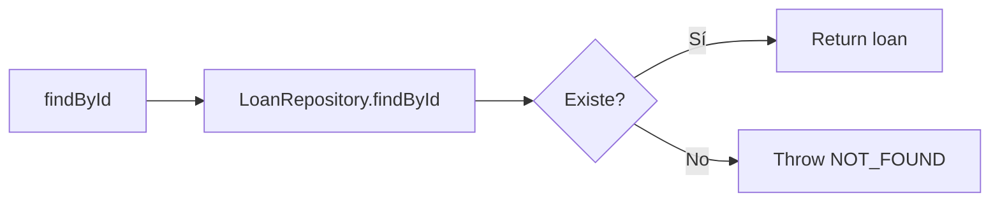
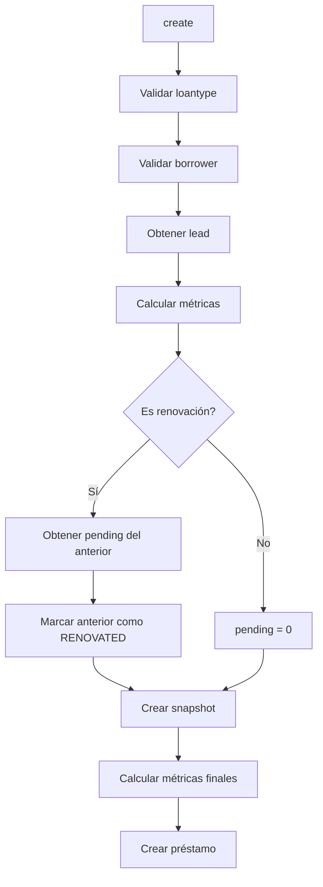
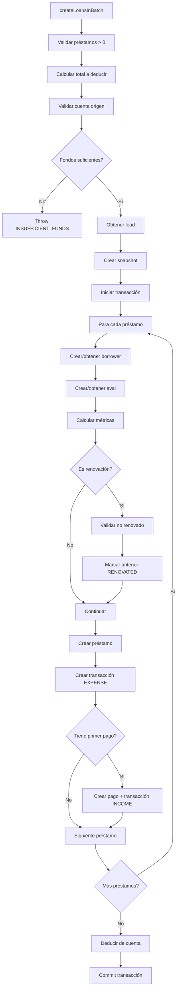
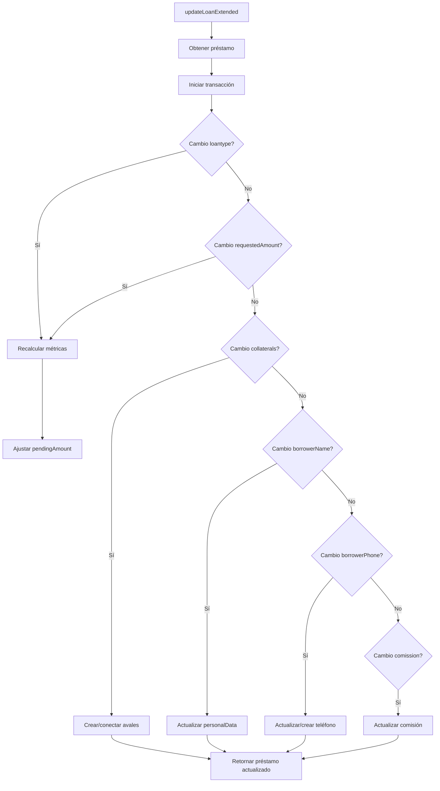
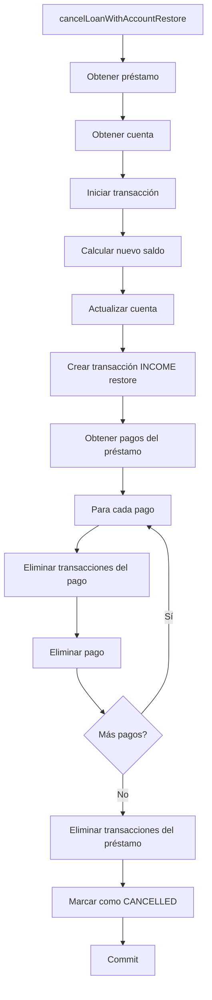
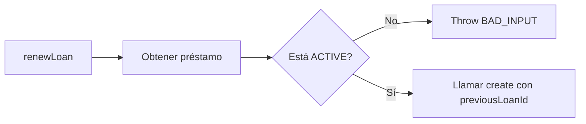

# LoanService - Documentación Técnica

## Descripción General

`LoanService` es el servicio principal para la gestión de préstamos en el API. Maneja la creación, actualización, renovación y cancelación de préstamos, así como las transacciones financieras asociadas.

## Arquitectura

```
apps/api/src/
├── services/
│   └── LoanService.ts      # Servicio principal
├── repositories/
│   ├── LoanRepository.ts   # Acceso a datos de préstamos
│   ├── BorrowerRepository.ts
│   ├── AccountRepository.ts
│   └── ...
└── resolvers/
    └── loans.ts            # Resolvers GraphQL
```

## Dependencias

```typescript
import { LoanRepository } from '../repositories/LoanRepository'
import { LoantypeRepository } from '../repositories/LoantypeRepository'
import { BorrowerRepository } from '../repositories/BorrowerRepository'
import { EmployeeRepository } from '../repositories/EmployeeRepository'
import { AccountRepository } from '../repositories/AccountRepository'
import { TransactionRepository } from '../repositories/TransactionRepository'
import { PaymentRepository } from '../repositories/PaymentRepository'
import { PersonalDataRepository } from '../repositories/PersonalDataRepository'
import { calculateLoanMetrics, createLoanSnapshot, calculatePaymentProfit } from '@solufacil/business-logic'
```

## Métodos Públicos

### findById(id: string)

Busca un préstamo por ID.



### findMany(options)

Lista préstamos con filtros opcionales.

**Opciones:**
- `status`: Estado del préstamo
- `routeId`: ID de ruta
- `leadId`: ID del líder
- `locationId`: ID de localidad
- `borrowerId`: ID del cliente
- `fromDate/toDate`: Rango de fechas
- `limit/offset`: Paginación

### create(input: CreateLoanInput)

Crea un préstamo individual.



### createLoansInBatch(input: CreateLoansInBatchInput)

Crea múltiples préstamos en una transacción atómica.



### updateLoanExtended(loanId: string, input: UpdateLoanExtendedInput)

Actualiza un préstamo con recálculo de métricas.



### cancelLoanWithAccountRestore(loanId: string, accountId: string)

Cancela un préstamo y restaura el saldo.



### renewLoan(loanId: string, input: RenewLoanInput)

Renueva un préstamo existente.



### Métodos Auxiliares

#### markAsBadDebt(loanId, badDebtDate)
Marca un préstamo como incobrable.

#### finishLoan(loanId)
Marca un préstamo como terminado.

#### cancelLoan(loanId)
Cancela un préstamo (sin restaurar saldo).

#### findForBadDebt(routeId?)
Busca préstamos candidatos a incobrable.

## Cálculos Financieros

### calculateLoanMetrics

```typescript
// packages/business-logic/src/calculations/profit.ts
function calculateLoanMetrics(
  requestedAmount: Decimal,
  rate: Decimal,
  weekDuration: number
): {
  profitAmount: Decimal,
  totalDebtAcquired: Decimal,
  expectedWeeklyPayment: Decimal
}

// Fórmulas:
profitAmount = requestedAmount × rate
totalDebtAcquired = requestedAmount + profitAmount
expectedWeeklyPayment = totalDebtAcquired / weekDuration
```

### calculatePaymentProfit

```typescript
function calculatePaymentProfit(
  paymentAmount: Decimal,
  totalProfit: Decimal,
  totalDebt: Decimal,
  isBadDebt: boolean
): {
  profitAmount: Decimal,
  returnToCapital: Decimal
}

// Fórmula normal:
profitAmount = (paymentAmount × totalProfit) / totalDebt
returnToCapital = paymentAmount - profitAmount

// Si es bad debt (después de badDebtDate):
profitAmount = paymentAmount
returnToCapital = 0
```

## Manejo de Renovaciones

### Reglas de Negocio

1. **Deuda pendiente se descuenta del monto entregado**, NO se suma a la deuda total.
2. El nuevo préstamo calcula sus métricas únicamente sobre el `requestedAmount`.
3. El préstamo anterior se marca como `RENOVATED`.

### Ejemplo

```
Préstamo anterior:
- requestedAmount: $10,000
- totalDebtAcquired: $12,000
- pendingAmountStored: $4,000

Nuevo préstamo (renovación):
- requestedAmount: $15,000
- rate: 20%
- profitAmount: $3,000 (15,000 × 0.20)
- totalDebtAcquired: $18,000 (15,000 + 3,000)
- amountGived: $11,000 (15,000 - 4,000)
```

## Transacciones Generadas

### Al crear préstamo

| Tipo | Source | Monto |
|------|--------|-------|
| EXPENSE | LOAN_GRANTED | amountGived |

### Al registrar pago

| Tipo | Source | Monto |
|------|--------|-------|
| INCOME | CASH_LOAN_PAYMENT o BANK_LOAN_PAYMENT | paymentAmount |
| EXPENSE | LOAN_PAYMENT_COMISSION | comission (si > 0) |

### Al cancelar préstamo

| Tipo | Source | Monto |
|------|--------|-------|
| INCOME | LOAN_CANCELLED_RESTORE | amountGived |

## Generación de Código de Cliente

```typescript
private async generateUniqueClientCode(tx?): Promise<string> {
  let code: string
  let exists: boolean

  do {
    code = generateClientCode() // Formato: ABC-123
    const personalData = await client.personalData.findUnique({
      where: { clientCode: code },
    })
    exists = !!personalData
  } while (exists)

  return code
}
```

## Manejo de Errores

| Código | Descripción |
|--------|-------------|
| `NOT_FOUND` | Recurso no encontrado |
| `BAD_USER_INPUT` | Datos de entrada inválidos |
| `INSUFFICIENT_FUNDS` | Fondos insuficientes en cuenta |

## Estados del Préstamo

```typescript
enum LoanStatus {
  ACTIVE     // Préstamo activo con pagos pendientes
  FINISHED   // Préstamo completado
  RENOVATED  // Préstamo renovado
  CANCELLED  // Préstamo cancelado
}
```

## Snapshot Histórico

Al crear un préstamo se guarda un snapshot del líder y ruta:

```typescript
const snapshot = createLoanSnapshot(
  lead.id,
  lead.personalDataRelation?.fullName || '',
  routeId,
  routeName
)

// Campos del snapshot:
{
  snapshotLeadId: string,
  snapshotLeadName: string,
  snapshotRouteId?: string,
  snapshotRouteName?: string
}
```

## Consideraciones de Rendimiento

1. **Transacciones atómicas**: `createLoansInBatch` y `updateLoanExtended` usan transacciones de Prisma para garantizar consistencia.

2. **Validación temprana**: Se validan fondos y existencia de recursos antes de iniciar operaciones costosas.

3. **Batch operations**: Se evitan N+1 queries al crear múltiples préstamos.
