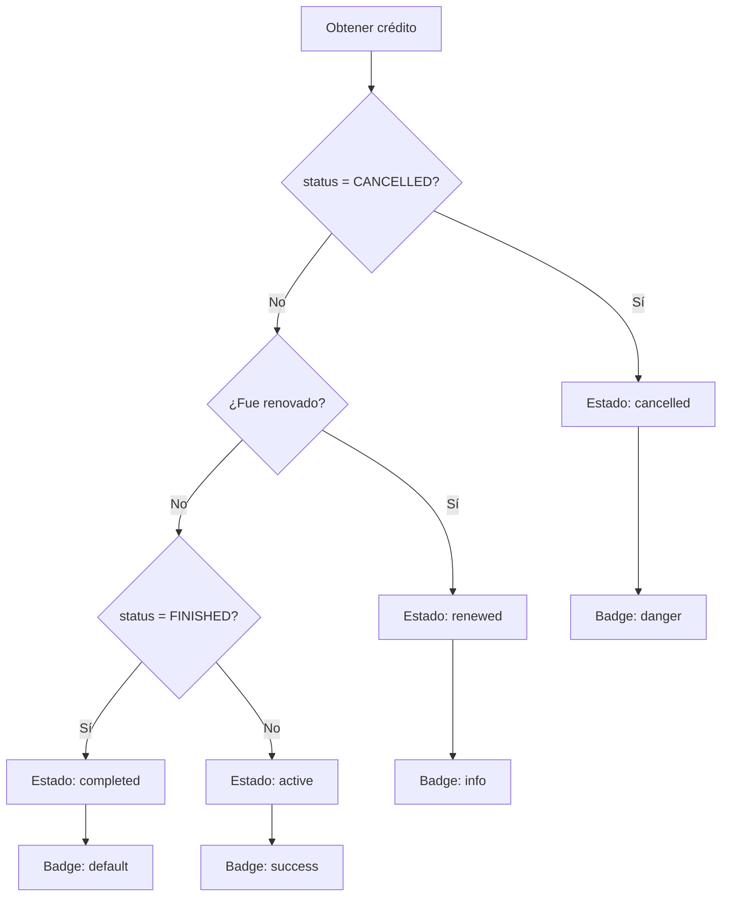
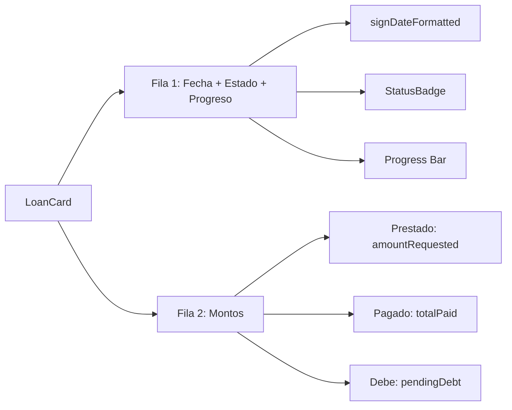
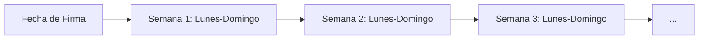
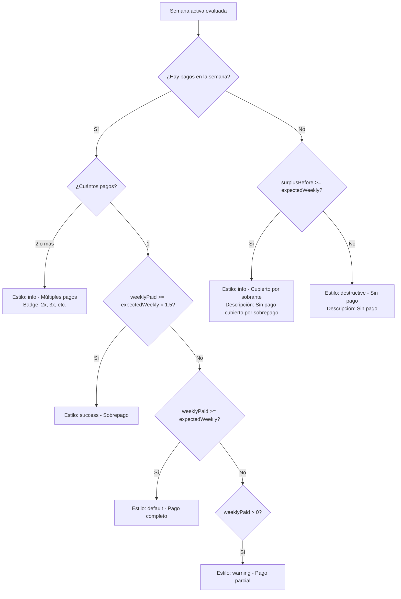
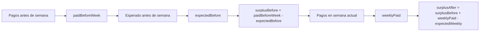
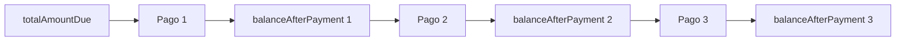
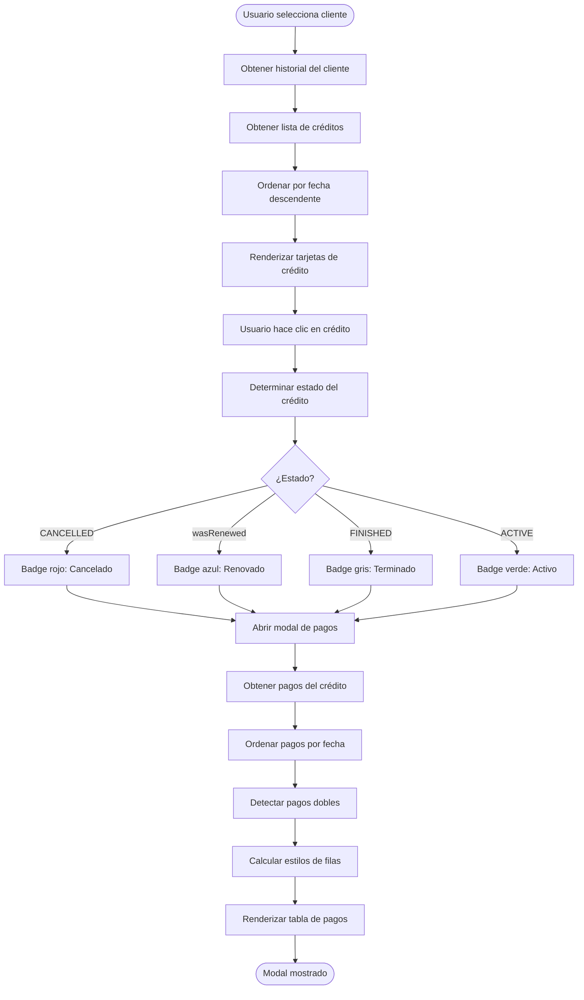
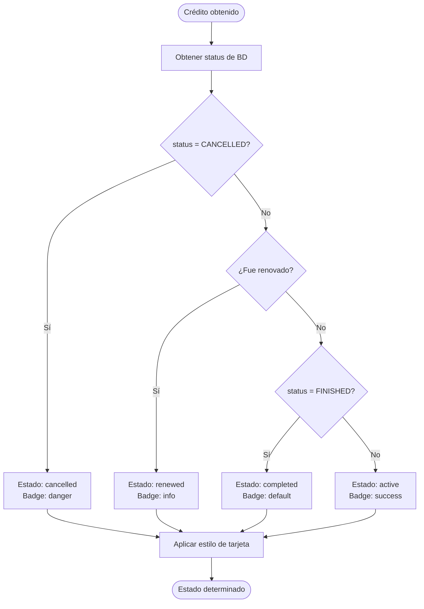
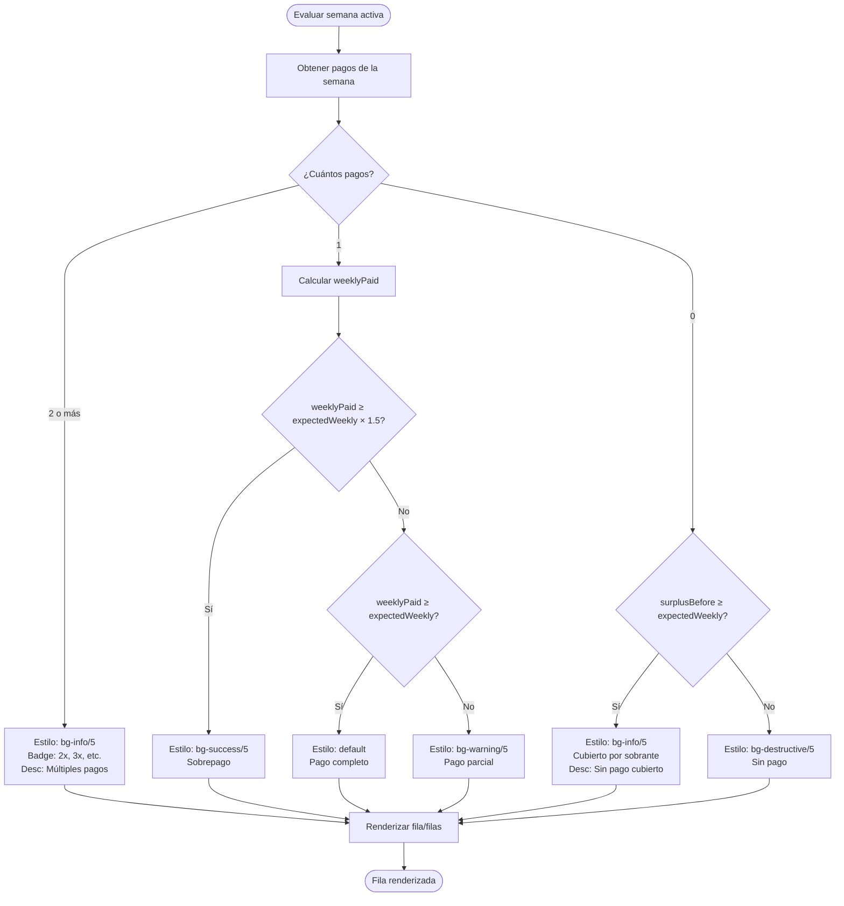
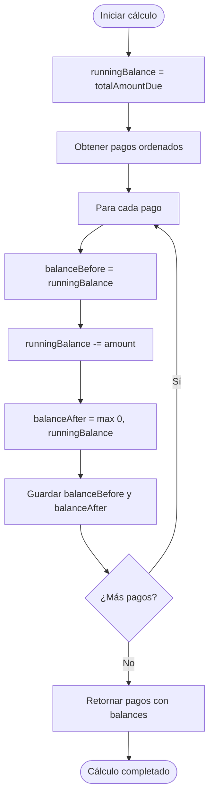

# Lógica de Negocio: Historial de Pagos

## Tabla de Contenidos

1. [Introducción](#introducción)
2. [Detección de Estado de Crédito](#detección-de-estado-de-crédito)
3. [Lista de Créditos](#lista-de-créditos)
4. [Tabla de Pagos de un Crédito](#tabla-de-pagos-de-un-crédito)
5. [Escenarios y Estilos de Filas](#escenarios-y-estilos-de-filas)
6. [Cálculo de Balances](#cálculo-de-balances)
7. [Edge Cases](#edge-cases)
8. [Diagramas de Flujo](#diagramas-de-flujo)

---

## Introducción

Este documento describe la lógica de negocio completa para la visualización de historiales de pagos de clientes. Incluye la detección de estados de crédito, la renderización de tablas de créditos y pagos, y todos los escenarios posibles con sus estilos correspondientes.

### Archivos Relacionados

- `apps/web/components/features/historial-clientes/` - Componentes de historial
- `apps/api/src/services/ClientHistoryService.ts` - Servicio de historial
- `apps/web/components/features/historial-clientes/components/LoanCard.tsx` - Tarjeta de crédito
- `apps/web/components/features/historial-clientes/components/PaymentHistoryModal.tsx` - Modal de pagos
- `apps/web/components/features/historial-clientes/constants.ts` - Constantes y estilos
- `apps/web/components/features/historial-clientes/utils.ts` - Utilidades

---

## Detección de Estado de Crédito

### Estados del Sistema

El sistema maneja 4 estados principales de crédito:

| Estado API | Descripción | Cuándo se Asigna |
|------------|-------------|-------------------|
| `ACTIVE` | Crédito activo con pagos pendientes | `pendingAmountStored > 0` y no renovado |
| `FINISHED` | Crédito completamente pagado | `pendingAmountStored = 0` |
| `RENOVATED` | Crédito renovado (reemplazado por otro) | Otro crédito tiene `previousLoan = este.id` |
| `CANCELLED` | Crédito cancelado | Marcado manualmente como cancelado |

### Lógica de Detección



### Función de Mapeo

```typescript
function mapApiStatus(apiStatus: string, wasRenewed: boolean): LoanStatusType {
  if (apiStatus === 'CANCELLED') return 'cancelled'
  if (wasRenewed) return 'renewed'
  if (apiStatus === 'FINISHED') return 'completed'
  return 'active'
}
```

### Detección de Renovación

Un crédito se considera **renovado** si existe otro crédito que tiene `previousLoan = este.id`:

```typescript
const wasRenewed = allLoans.some((l) => l.previousLoan === loan.id)
```

**Ejemplo:**
- Crédito A: `id = "loan-1"`
- Crédito B: `previousLoan = "loan-1"`
- Resultado: Crédito A tiene `wasRenewed = true`, estado = `renewed`

### Estados Visuales

| Estado Interno | Badge Variant | Color | Label |
|----------------|---------------|-------|-------|
| `active` | `success` | Verde | "Activo" |
| `completed` | `default` | Gris | "Terminado" |
| `renewed` | `info` | Azul | "Renovado" |
| `cancelled` | `danger` | Rojo | "Cancelado" |

---

## Lista de Créditos

### Estructura de la Tarjeta de Crédito

Cada crédito se muestra en una tarjeta (`LoanCard`) con la siguiente información:



### Campos Mostrados

| Campo | Fuente | Descripción |
|-------|--------|-------------|
| **Fecha** | `signDateFormatted` | Fecha de firma del crédito |
| **Estado** | `mapApiStatus(status, wasRenewed)` | Badge con estado visual |
| **Progreso** | `(totalPaid / totalAmountDue) × 100` | Barra de progreso porcentual |
| **Prestado** | `amountRequested` | Monto solicitado/otorgado |
| **Pagado** | `totalPaid` | Total pagado hasta la fecha |
| **Debe** | `pendingDebt` | Deuda pendiente actual |

### Cálculo de Progreso

```typescript
const progress = loan.totalAmountDue > 0
  ? Math.round((loan.totalPaid / loan.totalAmountDue) * 100)
  : 0
```

**Visualización:**
- Barra de progreso: `width = ${Math.min(progress, 100)}%`
- Color: Verde si `progress >= 100`, azul si `progress < 100`
- Porcentaje: Mostrado al lado de la barra

### Estilos de Tarjeta

| Condición | Estilo |
|-----------|--------|
| Estado `active` | `border-l-success` (borde izquierdo verde) |
| Otros estados | `border-l-transparent` (sin borde) |
| Hover | `hover:bg-accent/50` (fondo acentuado) |

### Ordenamiento

Los créditos se ordenan por fecha de firma (más recientes primero):

```typescript
const sortedLoans = [...loans].sort(
  (a, b) => new Date(b.signDate).getTime() - new Date(a.signDate).getTime()
)
```

---

## Tabla de Pagos de un Crédito

### Estructura de la Tabla

La tabla de pagos muestra cada pago agrupado por **semana activa** con la siguiente información:

| Columna | Descripción | Fuente |
|---------|-------------|--------|
| **#** | Número de pago o semana | `paymentNumber` o `weekIndex` |
| **Fecha** | Fecha de recepción o semana | `receivedAtFormatted` o rango de semana |
| **Pagado** | Monto del pago o total semanal | `amount` o `weeklyPaid` |
| **Deuda** | Deuda restante después del pago | `balanceAfterPayment` |

### Concepto de Semana Activa

Una **semana activa** se define como el período de 7 días (lunes a domingo) desde la fecha de firma del crédito:



**Cálculo de Semana Activa:**
```typescript
// Para cada semana desde la fecha de firma
for (let week = 1; week <= totalWeeks; week++) {
  const weekPaymentDate = new Date(signDate)
  weekPaymentDate.setDate(weekPaymentDate.getDate() + week * 7)
  
  // Calcular lunes y domingo de la semana
  const weekMonday = new Date(weekPaymentDate)
  const dayOfWeekMonday = weekMonday.getDay()
  const daysToMonday = dayOfWeekMonday === 0 ? -6 : 1 - dayOfWeekMonday
  weekMonday.setDate(weekMonday.getDate() + daysToMonday)
  weekMonday.setHours(0, 0, 0, 0)
  
  const weekSunday = new Date(weekMonday)
  weekSunday.setDate(weekSunday.getDate() + 6)
  weekSunday.setHours(23, 59, 59, 999)
}
```

### Agrupación de Pagos por Semana

Los pagos se agrupan por semana activa en lugar de mostrarse individualmente:

```typescript
// Encontrar todos los pagos en esta semana
const paymentsInWeek = sortedPayments.filter((payment) => {
  const paymentDate = new Date(payment.receivedAt)
  return paymentDate >= weekMonday && paymentDate <= weekSunday
})

const weeklyPaid = paymentsInWeek.reduce(
  (sum, p) => sum + (p.amount || 0),
  0
)
```

### Ordenamiento de Pagos

Los pagos se ordenan cronológicamente (más antiguos primero) y luego se agrupan por semana:

```typescript
const sortedPayments = [...loan.payments].sort(
  (a, b) => new Date(a.receivedAt).getTime() - new Date(b.receivedAt).getTime()
)
```

### Detección de Múltiples Pagos en la Misma Semana

Se detectan múltiples pagos en la misma semana activa (no solo misma fecha):

```typescript
// Si hay 2 o más pagos en la misma semana
if (paymentsInWeek.length >= 2) {
  // Marcar como múltiples pagos en semana
  isMultiplePaymentsInWeek = true
  paymentsCount = paymentsInWeek.length
}
```

**Visualización:**
- Badge "2x", "3x", etc. al lado de la fecha
- Estilo especial: `bg-info/5 border-l-4 border-l-info`
- Descripción: "Pago #1 (1/2)", "Pago #2 (2/2)" para cada pago individual

---

## Escenarios y Estilos de Filas

### Cálculo de Pago Semanal Esperado

```typescript
const expectedWeekly = loan.weekDuration > 0 
  ? loan.totalAmountDue / loan.weekDuration 
  : 0
```

### Cálculo de Sobrante (Surplus)

El sobrante se calcula acumulativamente semana a semana:

```typescript
// Pagado antes de esta semana
const paidBeforeWeek = (loan.payments || []).reduce((sum, p) => {
  const d = new Date(p.receivedAt).getTime()
  return d < weekMonday.getTime() ? sum + (p.amount || 0) : sum
}, 0)

// Esperado antes de esta semana
const expectedBefore = (week - 1) * expectedWeekly

// Sobrante antes de esta semana
const surplusBefore = paidBeforeWeek - expectedBefore

// Sobrante después de esta semana
const surplusAfter = surplusBefore + weeklyPaid - expectedWeekly
```

### Lógica de Estilos de Fila Basada en Semana Activa



### Función de Estilos Basada en Semana

```typescript
function getRowStylesForWeek(
  paymentsInWeek: Payment[],
  weeklyPaid: number,
  expectedWeekly: number,
  surplusBefore: number
): { style: string, description: string, badge?: string } {
  const paymentsCount = paymentsInWeek.length
  
  // 1. Múltiples pagos en la misma semana (2 o más)
  if (paymentsCount >= 2) {
    return {
      style: 'bg-info/5 border-l-4 border-l-info',
      description: `${paymentsCount} pagos en la semana`,
      badge: `${paymentsCount}x`
    }
  }
  
  // 2. Hay pagos en la semana
  if (paymentsCount > 0) {
    // 2a. Sobrepago (≥ 150% del esperado)
    if (weeklyPaid >= expectedWeekly * 1.5) {
      return {
        style: 'bg-success/5 border-l-4 border-l-success',
        description: 'Sobrepago'
      }
    }
    
    // 2b. Pago completo (≥ 100% del esperado)
    if (weeklyPaid >= expectedWeekly) {
      return {
        style: '', // Sin estilo especial
        description: 'Pago completo'
      }
    }
    
    // 2c. Pago parcial (> 0 pero < esperado)
    return {
      style: 'bg-warning/5 border-l-4 border-l-warning',
      description: 'Pago parcial'
    }
  }
  
  // 3. No hay pagos en la semana
  // 3a. Cubierto por sobrante de semana anterior
  if (surplusBefore >= expectedWeekly && expectedWeekly > 0) {
    return {
      style: 'bg-info/5 border-l-4 border-l-info',
      description: 'Sin pago (cubierto por sobrepago)'
    }
  }
  
  // 3b. Sin pago y sin cobertura
  return {
    style: 'bg-destructive/5 border-l-4 border-l-destructive',
    description: 'Sin pago'
  }
}
```

### Tabla de Escenarios por Semana Activa

| Escenario | Condición | Estilo CSS | Color | Descripción | Badge |
|-----------|-----------|------------|-------|-------------|-------|
| **Múltiples Pagos** | `paymentsInWeek.length ≥ 2` | `bg-info/5 border-l-4 border-l-info` | Azul | 2 o más pagos en la semana | "2x", "3x", etc. |
| **Sobrepago** | `weeklyPaid ≥ expectedWeekly × 1.5` | `bg-success/5 border-l-4 border-l-success` | Verde | Pago excede significativamente | - |
| **Pago Completo** | `weeklyPaid ≥ expectedWeekly` | (sin estilo) | - | Pago normal esperado | - |
| **Pago Parcial** | `0 < weeklyPaid < expectedWeekly` | `bg-warning/5 border-l-4 border-l-warning` | Amarillo | Pago insuficiente | - |
| **Cubierto por Sobrante** | `paymentsInWeek.length = 0` y `surplusBefore ≥ expectedWeekly` | `bg-info/5 border-l-4 border-l-info` | Azul | Sin pago pero cubierto | - |
| **Sin Pago** | `paymentsInWeek.length = 0` y `surplusBefore < expectedWeekly` | `bg-destructive/5 border-l-4 border-l-destructive` | Rojo | No se recibió pago | - |

### Ejemplos Numéricos

**Ejemplo 1: Crédito a 14 semanas, $4,200 total**
- `expectedWeekly = $4,200 / 14 = $300`

**Semana 1:**
- Pago 1: $300 el lunes
- Pago 2: $200 el viernes
- `weeklyPaid = $500`
- `paymentsInWeek.length = 2`
- **Resultado:** Estilo azul, badge "2x", descripción "2 pagos en la semana"

**Semana 2:**
- Pago único: $450 el miércoles
- `weeklyPaid = $450`
- `450 ≥ 300 × 1.5 = 450`
- **Resultado:** Estilo verde, "Sobrepago"

**Semana 3:**
- Pago único: $300 el lunes
- `weeklyPaid = $300`
- `300 ≥ 300`
- **Resultado:** Sin estilo especial, "Pago completo"

**Semana 4:**
- Pago único: $150 el miércoles
- `weeklyPaid = $150`
- `0 < 150 < 300`
- **Resultado:** Estilo amarillo, "Pago parcial"

**Semana 5:**
- Sin pagos
- `surplusBefore = $150` (de semana 4)
- `150 < 300`
- **Resultado:** Estilo rojo, "Sin pago"

**Semana 6:**
- Sin pagos
- `surplusBefore = $450` (acumulado de semanas anteriores)
- `450 ≥ 300`
- **Resultado:** Estilo azul, "Sin pago (cubierto por sobrepago)"

### Cálculo de Coverage Type

El sistema calcula un `coverageType` para cada semana:

```typescript
let coverageType: CoverageType = 'MISS'

if (weeklyPaid >= expectedWeekly) {
  coverageType = 'FULL'
} else if (coversWithSurplus && weeklyPaid > 0) {
  coverageType = 'COVERED_BY_SURPLUS'
} else if (coversWithSurplus && weeklyPaid === 0) {
  coverageType = 'COVERED_BY_SURPLUS'
} else if (weeklyPaid > 0) {
  coverageType = 'PARTIAL'
}
```

Donde:
```typescript
const coversWithSurplus = 
  surplusBefore + weeklyPaid >= expectedWeekly && expectedWeekly > 0
```

---

## Cálculo de Sobrante y Cobertura

### Concepto de Sobrante (Surplus)

El **sobrante** es el exceso de pagos acumulado que excede lo esperado hasta una semana determinada. Se calcula semana a semana y puede usarse para cubrir semanas sin pago.

### Cálculo del Sobrante



### Fórmulas

```typescript
// Pagado antes de esta semana
const paidBeforeWeek = pagos.filter(p => p.receivedAt < weekMonday)
  .reduce((sum, p) => sum + p.amount, 0)

// Esperado antes de esta semana
const expectedBefore = (week - 1) * expectedWeekly

// Sobrante antes de esta semana
const surplusBefore = paidBeforeWeek - expectedBefore

// Sobrante después de esta semana
const surplusAfter = surplusBefore + weeklyPaid - expectedWeekly
```

### Ejemplo de Cálculo de Sobrante

**Crédito:** $4,200 total, 14 semanas, `expectedWeekly = $300`

| Semana | Pagos en Semana | weeklyPaid | paidBeforeWeek | expectedBefore | surplusBefore | surplusAfter |
|--------|-----------------|------------|----------------|----------------|---------------|--------------|
| 1 | $350 | $350 | $0 | $0 | $0 | $50 |
| 2 | $300 | $300 | $350 | $300 | $50 | $50 |
| 3 | $400 | $400 | $650 | $600 | $50 | $150 |
| 4 | $0 | $0 | $1,050 | $900 | $150 | -$150 |
| 5 | $0 | $0 | $1,050 | $1,200 | -$150 | -$450 |

**Análisis:**
- Semana 1: Sobrante de $50 (pago de $350 vs esperado $300)
- Semana 2: Sobrante se mantiene en $50 (pago exacto)
- Semana 3: Sobrante aumenta a $150 (pago de $400)
- Semana 4: Sin pago, pero `surplusBefore = $150 ≥ $300` → **NO cubre**
- Semana 5: Sin pago, `surplusBefore = -$150 < $300` → **No cubre**

### Determinación de Cobertura por Sobrante

Una semana sin pago se considera **cubierta por sobrante** si:

```typescript
const coversWithSurplus = 
  surplusBefore + weeklyPaid >= expectedWeekly && expectedWeekly > 0
```

**Condiciones:**
1. `surplusBefore ≥ expectedWeekly` (el sobrante cubre el 100% del pago esperado)
2. `expectedWeekly > 0` (evita división por cero)

**Ejemplo de Cobertura:**

**Escenario:** Semana 4 sin pago
- `surplusBefore = $150`
- `expectedWeekly = $300`
- `150 < 300` → **NO cubre** → Estilo rojo

**Escenario:** Semana 4 sin pago (con sobrante suficiente)
- `surplusBefore = $350`
- `expectedWeekly = $300`
- `350 ≥ 300` → **SÍ cubre** → Estilo azul, "Sin pago (cubierto por sobrepago)"

### Visualización de Semanas Cubiertas por Sobrante

Cuando una semana está cubierta por sobrante:

```typescript
if (paymentsInWeek.length === 0 && surplusBefore >= expectedWeekly) {
  return {
    style: 'bg-info/5 border-l-4 border-l-info',
    description: 'Sin pago (cubierto por sobrepago)',
    coverageType: 'COVERED_BY_SURPLUS'
  }
}
```

**Características:**
- **NO se muestra en rojo** (aunque no haya pago)
- Estilo azul (`bg-info/5 border-l-4 border-l-info`)
- Descripción clara: "Sin pago (cubierto por sobrepago)"
- `coverageType = 'COVERED_BY_SURPLUS'`

---

## Cálculo de Balances

### Balance Progresivo

El balance se calcula progresivamente desde el total de la deuda:



### Algoritmo de Cálculo

```typescript
let runningBalance = totalAmountDue

const payments = loan.payments.map((p, idx) => {
  const amount = parseFloat(p.amount || '0')
  const balanceBefore = runningBalance
  runningBalance -= amount
  const balanceAfter = Math.max(0, runningBalance) // Nunca negativo
  
  return {
    balanceBeforePayment: balanceBefore,
    balanceAfterPayment: balanceAfter,
  }
})
```

### Fórmula

```
balanceBeforePayment = deudaTotal - (suma de pagos anteriores)
balanceAfterPayment = max(0, balanceBeforePayment - amount)
```

### Ejemplo de Cálculo

**Crédito:** $4,200 total, 3 pagos

| Pago | Monto | Balance Antes | Balance Después |
|------|-------|---------------|-----------------|
| 1 | $300 | $4,200 | $3,900 |
| 2 | $300 | $3,900 | $3,600 |
| 3 | $500 | $3,600 | $3,100 |

### Visualización de Deuda

En la columna "Deuda" de la tabla:

```typescript
<span className={
  payment.remainingDebt === 0
    ? 'text-success'  // Verde si pagado
    : 'text-destructive'  // Rojo si debe
}>
  {formatCurrency(payment.remainingDebt)}
</span>
```

---

## Edge Cases

### 1. Crédito sin Pagos

**Escenario:** Crédito recién creado, sin pagos registrados.

**Comportamiento:**
- Tabla de pagos vacía
- Mensaje: "Sin pagos registrados"
- `expectedWeekly` se calcula normalmente
- `pendingDebt = totalAmountDue`

### 2. Pago Mayor a Deuda Pendiente

**Escenario:** Cliente paga más de lo que debe.

**Comportamiento:**
- `balanceAfterPayment = 0` (nunca negativo)
- El préstamo se marca como `FINISHED`
- El exceso no se registra (o se maneja según política)

### 3. Múltiples Pagos en la Misma Semana Activa

**Escenario:** Cliente realiza 2 o más pagos en la misma semana activa (lunes a domingo).

**Comportamiento:**
- Se detectan como "múltiples pagos en semana"
- Badge "2x", "3x", etc. al lado de la fecha
- Estilo azul (`bg-info/5 border-l-4 border-l-info`)
- Cada pago se muestra individualmente con descripción "Pago #1 (1/2)", "Pago #2 (2/2)"
- El total semanal (`weeklyPaid`) es la suma de todos los pagos de la semana

### 4. Crédito Renovado Múltiples Veces

**Escenario:** Crédito A → Renovado por B → Renovado por C.

**Comportamiento:**
- Crédito A: `wasRenewed = true`, `renewedTo = B.id`
- Crédito B: `wasRenewed = true`, `renewedTo = C.id`
- Crédito C: `wasRenewed = false` (último)

### 5. Crédito con weekDuration = 0

**Escenario:** Crédito sin duración definida.

**Comportamiento:**
- `expectedWeekly = 0` (evita división por cero)
- Todos los pagos se consideran "completos" o "sobrepago"
- No se aplican estilos basados en porcentaje

### 6. Pagos con Montos Negativos o Cero

**Escenario:** Datos corruptos o pagos cancelados.

**Protección:**
- `amount` siempre se parsea como número positivo
- Si `amount <= 0`, se muestra como "Sin pago"
- Estilo destructivo aplicado

### 7. Balance Negativo por Error de Cálculo

**Protección:**
```typescript
const balanceAfter = Math.max(0, runningBalance)
```
- El balance nunca puede ser negativo
- Si el cálculo resulta negativo, se establece en 0

### 8. Crédito Cancelado con Pagos

**Escenario:** Crédito cancelado que tenía pagos previos.

**Comportamiento:**
- Estado: `cancelled` (badge rojo)
- Pagos se muestran normalmente en el historial
- `pendingDebt` puede ser > 0

### 9. Fechas de Pago Futuras

**Escenario:** Pago registrado con fecha futura (error de entrada).

**Comportamiento:**
- Se ordena cronológicamente según `receivedAt`
- Se agrupa en la semana activa correspondiente
- Se muestra normalmente en la tabla
- No hay validación de fecha futura (asumimos datos correctos)

### 11. Semana sin Pago pero con Sobrante Suficiente

**Escenario:** No hay pagos en la semana activa, pero el sobrante de semanas anteriores cubre el 100% del pago esperado.

**Comportamiento:**
- `paymentsInWeek.length = 0`
- `surplusBefore ≥ expectedWeekly`
- **NO se muestra en rojo**
- Estilo azul (`bg-info/5 border-l-4 border-l-info`)
- Descripción: "Sin pago (cubierto por sobrepago)"
- `coverageType = 'COVERED_BY_SURPLUS'`

**Ejemplo:**
- Semana 1: Pago de $450 (esperado $300) → Sobrante: $150
- Semana 2: Pago de $350 (esperado $300) → Sobrante acumulado: $200
- Semana 3: Sin pago, pero sobrante $200 ≥ $300 esperado
- **Resultado:** Semana 3 se muestra en azul, no en rojo

### 12. Semana sin Pago y sin Sobrante Suficiente

**Escenario:** No hay pagos en la semana activa y el sobrante no cubre el pago esperado.

**Comportamiento:**
- `paymentsInWeek.length = 0`
- `surplusBefore < expectedWeekly`
- **Se muestra en rojo**
- Estilo destructivo (`bg-destructive/5 border-l-4 border-l-destructive`)
- Descripción: "Sin pago"
- `coverageType = 'MISS'`

### 10. Crédito con totalAmountDue = 0

**Escenario:** Crédito con datos inconsistentes.

**Protección:**
```typescript
const progress = loan.totalAmountDue > 0
  ? Math.round((loan.totalPaid / loan.totalAmountDue) * 100)
  : 0
```
- Progreso = 0% si `totalAmountDue = 0`
- Evita división por cero

---

## Diagramas de Flujo

### Flujo Completo: Visualización de Historial



### Flujo: Detección de Estado de Crédito



### Flujo: Cálculo de Estilos de Fila por Semana Activa



### Flujo: Cálculo de Balance Progresivo



---

## Resumen de Reglas de Negocio

### Detección de Estado

1. **CANCELLED** tiene prioridad sobre todo
2. **RENOVATED** se detecta si otro crédito tiene `previousLoan = este.id`
3. **FINISHED** si `status = FINISHED` y no fue renovado
4. **ACTIVE** es el estado por defecto

### Estilos de Pago por Semana Activa

1. **Múltiples pagos** tiene prioridad (2+ pagos en misma semana) → Azul con badge
2. **Sobrepago** si `weeklyPaid ≥ expectedWeekly × 1.5` → Verde
3. **Completo** si `weeklyPaid ≥ expectedWeekly` → Sin estilo especial
4. **Parcial** si `0 < weeklyPaid < expectedWeekly` → Amarillo
5. **Cubierto por sobrante** si no hay pagos pero `surplusBefore ≥ expectedWeekly` → Azul
6. **Sin pago** si no hay pagos y `surplusBefore < expectedWeekly` → Rojo

### Cálculos

1. **Progreso**: `(totalPaid / totalAmountDue) × 100`, máximo 100%
2. **Expected Weekly**: `totalAmountDue / weekDuration`, mínimo 0
3. **Balance**: Nunca puede ser negativo (`Math.max(0, balance)`)

### Ordenamiento

1. **Créditos**: Por fecha de firma descendente (más recientes primero)
2. **Pagos**: Por fecha de recepción ascendente (más antiguos primero)

---

## Referencias

- [Business Logic: Profit Calculations](./business-logic-profit.md)
- [Client History Service](../apps/api/src/services/ClientHistoryService.ts)
- [Payment History Modal](../apps/web/components/features/historial-clientes/components/PaymentHistoryModal.tsx)
- [Loan Card Component](../apps/web/components/features/historial-clientes/components/LoanCard.tsx)
- [Constants and Styles](../apps/web/components/features/historial-clientes/constants.ts)

---

## Notas Finales

1. **Estado vs wasRenewed**: El estado visual considera tanto `status` como `wasRenewed`. Un crédito `FINISHED` que fue renovado se muestra como "Renovado", no "Terminado".

2. **Pagos Dobles**: La detección se basa en la fecha formateada (sin hora), por lo que pagos en el mismo día se consideran dobles.

3. **Balance Progresivo**: El balance se calcula secuencialmente, asumiendo que los pagos están ordenados cronológicamente.

4. **Estilos Responsivos**: Todos los estilos usan variables CSS para soportar temas claro/oscuro.

5. **Precisión Decimal**: Los montos se formatean con 0 decimales para mejor legibilidad en tablas.


