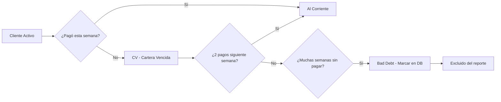
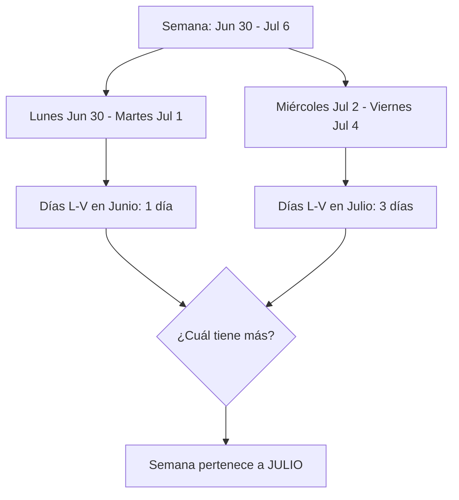
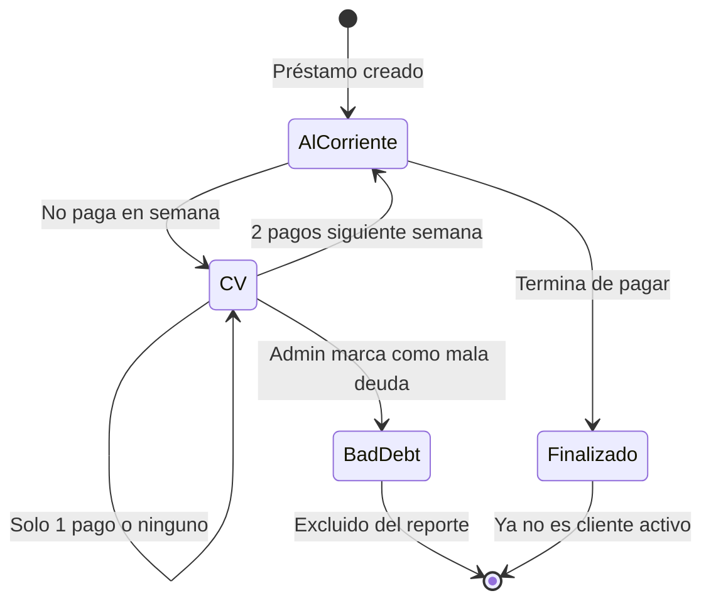
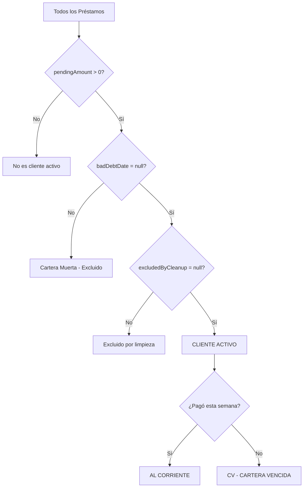
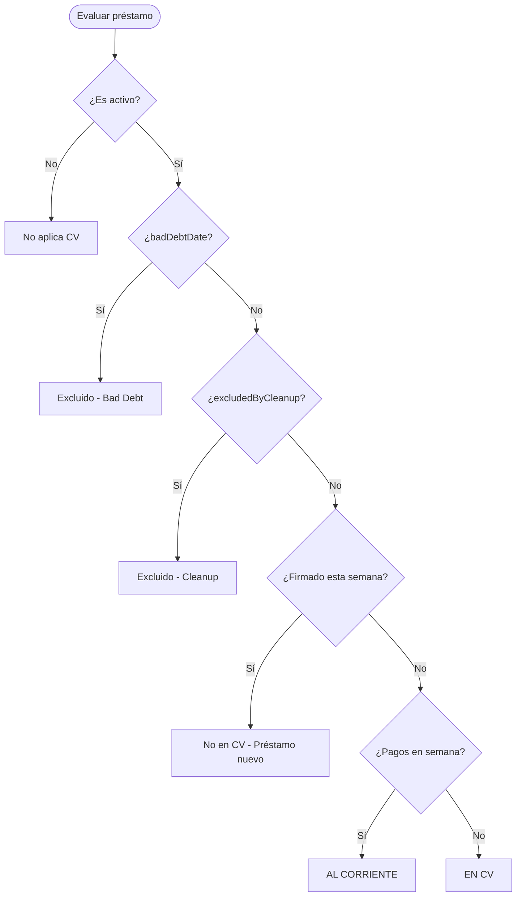
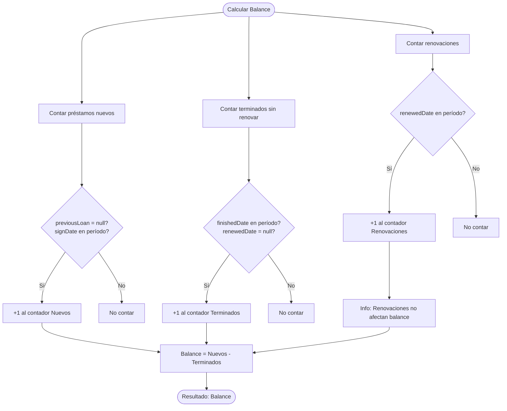
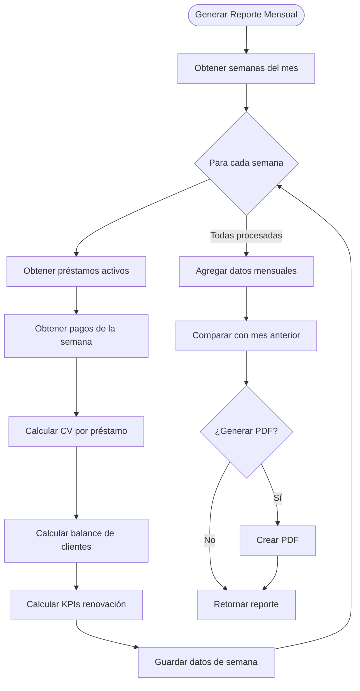

# Lógica de Negocio: Reporte de Cartera

## Tabla de Contenidos

1. [Introducción](#introducción)
2. [Conceptos Fundamentales](#conceptos-fundamentales)
3. [Semana Activa](#semana-activa)
4. [Cartera Vencida (CV)](#cartera-vencida-cv)
5. [Cliente Activo vs Cliente Al Corriente](#cliente-activo-vs-cliente-al-corriente)
6. [Balance de Clientes](#balance-de-clientes)
7. [KPIs de Renovación](#kpis-de-renovación)
8. [Ejemplos](#ejemplos)
9. [Edge Cases](#edge-cases)
10. [Diagramas de Flujo](#diagramas-de-flujo)

---

## Introducción

Este documento describe la lógica de negocio para el **Reporte de Cartera**, un sistema que calcula y presenta métricas de cobranza semanal y mensual. El reporte permite visualizar el estado de la cartera de clientes, identificar clientes en mora (CV), y analizar tendencias de crecimiento o decrecimiento de clientes.

> **Nota sobre Diagramas Mermaid**: Este documento contiene diagramas Mermaid que visualizan los flujos de negocio. Para verlos correctamente:
> - En GitHub/GitLab: Se renderizan automáticamente
> - En VSCode/Cursor: Instala la extensión "Markdown Preview Mermaid Support"

### Archivos Relacionados

- `packages/business-logic/src/calculations/active-week.ts` - Cálculos de semana activa
- `packages/business-logic/src/calculations/portfolio.ts` - Cálculos de CV y balance
- `packages/business-logic/src/types/portfolio.ts` - Tipos compartidos
- `apps/api/src/services/PortfolioReportService.ts` - Servicio principal

---

## Conceptos Fundamentales

### Términos Clave

| Término | Definición |
|---------|------------|
| **CV (Cartera Vencida)** | Préstamo activo que NO recibió pago en la semana activa |
| **Cartera Muerta (Bad Debt)** | Préstamo marcado con `badDebtDate` - considerado irrecuperable |
| **Semana Activa** | Período de Lunes 00:00 a Domingo 23:59 |
| **Cliente Activo** | Tiene préstamo con deuda pendiente, sin `badDebtDate`, no excluido |
| **Cliente Al Corriente** | Cliente activo que NO está en CV |
| **Balance de Clientes** | Diferencia entre clientes nuevos y clientes que terminaron sin renovar |

### CV vs Bad Debt (Cartera Muerta)

Es **CRÍTICO** entender la diferencia:

| Aspecto | CV (Cartera Vencida) | Bad Debt (Cartera Muerta) |
|---------|---------------------|---------------------------|
| **Definición** | No pagó en semana activa | Cartera perdida/irrecuperable |
| **Almacenamiento** | **CALCULADA** en runtime | **GUARDADA** en DB (`badDebtDate`) |
| **Reversible** | Sí (2 pagos siguiente semana) | No |
| **Visible en reporte** | Sí, como "cliente en mora" | No (excluido del reporte) |



---

## Semana Activa

### Definición

La **semana activa** es el período de cobranza que va de **Lunes 00:00:00 a Domingo 23:59:59**.

> **IMPORTANTE**: NO usa el estándar ISO (Domingo a Sábado). La semana empieza en **LUNES**.

### Asignación de Semana a Mes

Una semana se asigna al mes donde caigan **más días de entre semana (Lunes a Viernes)**.

**Regla**: Contar días L-V en cada mes. El mes con más días gana.



### Fórmulas

```typescript
// Obtener inicio de semana activa (Lunes 00:00)
function getWeekStart(date: Date): Date {
  const d = new Date(date)
  const day = d.getDay() // 0=Dom, 1=Lun, ..., 6=Sab
  const diff = day === 0 ? -6 : 1 - day // Ajustar a Lunes
  d.setDate(d.getDate() + diff)
  d.setHours(0, 0, 0, 0)
  return d
}

// Obtener fin de semana activa (Domingo 23:59:59)
function getWeekEnd(weekStart: Date): Date {
  const d = new Date(weekStart)
  d.setDate(d.getDate() + 6)
  d.setHours(23, 59, 59, 999)
  return d
}

// Determinar mes de la semana (por días L-V)
function getWeekBelongsToMonth(weekStart: Date): { month: number, year: number } {
  const monthDays: Record<string, number> = {}

  for (let i = 0; i < 5; i++) { // Solo L-V (5 días)
    const d = new Date(weekStart)
    d.setDate(d.getDate() + i)
    const key = `${d.getFullYear()}-${d.getMonth()}`
    monthDays[key] = (monthDays[key] || 0) + 1
  }

  // Encontrar mes con más días
  let maxKey = Object.keys(monthDays)[0]
  for (const key of Object.keys(monthDays)) {
    if (monthDays[key] > monthDays[maxKey]) {
      maxKey = key
    }
  }

  const [year, month] = maxKey.split('-').map(Number)
  return { year, month }
}
```

### Ejemplos de Asignación

| Semana | Días L-V | Pertenece a |
|--------|----------|-------------|
| Dic 30, 2024 - Ene 5, 2025 | Dic: 2 (L,M), Ene: 3 (Mi,J,V) | **Enero 2025** |
| Jun 30 - Jul 6, 2025 | Jun: 1 (L), Jul: 4 (M,Mi,J,V) | **Julio 2025** |
| Jul 28 - Ago 3, 2025 | Jul: 4 (L,M,Mi,J), Ago: 1 (V) | **Julio 2025** |

---

## Cartera Vencida (CV)

### Definición

Un préstamo está en **CV (Cartera Vencida)** si:
1. Es un préstamo activo (`pendingAmountStored > 0`)
2. NO tiene `badDebtDate`
3. NO está excluido por `PortfolioCleanup`
4. **NO recibió ningún pago en la semana activa**

### Cálculo

```typescript
function isInCarteraVencida(
  payments: Payment[],
  weekStart: Date,
  weekEnd: Date
): boolean {
  // Buscar si hay al menos UN pago en la semana activa
  const hasPaymentInWeek = payments.some(payment => {
    const receivedAt = new Date(payment.receivedAt)
    return receivedAt >= weekStart && receivedAt <= weekEnd
  })

  return !hasPaymentInWeek // Si NO hay pago, está en CV
}
```

### Salir de CV

Un cliente **sale de CV** si hace **2 pagos** en la siguiente semana:

```typescript
function exitedCarteraVencida(
  payments: Payment[],
  nextWeekStart: Date,
  nextWeekEnd: Date
): boolean {
  const paymentsInNextWeek = payments.filter(payment => {
    const receivedAt = new Date(payment.receivedAt)
    return receivedAt >= nextWeekStart && receivedAt <= nextWeekEnd
  })

  return paymentsInNextWeek.length >= 2
}
```

### Diagrama de Estados CV



---

## Cliente Activo vs Cliente Al Corriente

### Cliente Activo

Un **cliente activo** cumple TODAS estas condiciones:

```typescript
function isActiveLoan(loan: Loan): boolean {
  return (
    loan.pendingAmountStored > 0 &&     // Tiene deuda pendiente
    loan.badDebtDate === null &&         // NO es cartera muerta
    loan.excludedByCleanup === null      // NO está excluido
  )
}
```

### Cliente Al Corriente

Un **cliente al corriente** es un cliente activo que **NO está en CV**:

```typescript
function isClienteAlCorriente(
  loan: Loan,
  payments: Payment[],
  weekStart: Date,
  weekEnd: Date
): boolean {
  if (!isActiveLoan(loan)) return false

  const inCV = isInCarteraVencida(payments, weekStart, weekEnd)
  return !inCV // Al corriente = activo y NO en CV
}
```

### Resumen Visual



---

## Balance de Clientes

### Definición

El **balance de clientes** mide el crecimiento o decrecimiento de la cartera:

| Evento | Balance |
|--------|---------|
| Cliente nuevo (primer préstamo) | **+1** |
| Cliente termina y NO renueva | **-1** |
| Cliente renueva | **0** (neutro) |

### Fórmula

```
Balance = Clientes Nuevos - Clientes que Terminaron Sin Renovar
```

### Identificación

```typescript
// Cliente NUEVO: Primer préstamo (sin previousLoan)
const esNuevo = loan.previousLoan === null &&
                loan.signDate >= periodStart &&
                loan.signDate <= periodEnd

// TERMINÓ SIN RENOVAR: Terminó y no renovó
const terminoSinRenovar = loan.finishedDate !== null &&
                          loan.finishedDate >= periodStart &&
                          loan.finishedDate <= periodEnd &&
                          loan.renewedDate === null

// RENOVÓ: Tiene fecha de renovación en el período
const renovo = loan.renewedDate !== null &&
               loan.renewedDate >= periodStart &&
               loan.renewedDate <= periodEnd
```

### Ejemplo

| Mes | Nuevos | Terminados sin renovar | Renovaciones | Balance |
|-----|--------|------------------------|--------------|---------|
| Enero | 15 | 8 | 12 | **+7** |
| Febrero | 10 | 12 | 10 | **-2** |
| Marzo | 20 | 10 | 15 | **+10** |

---

## KPIs de Renovación

### Métricas

| KPI | Fórmula |
|-----|---------|
| **Tasa de Renovación** | `Renovaciones / (Renovaciones + TerminadosSinRenovar)` |
| **Total Renovaciones** | Préstamos con `renewedDate` en el período |
| **Total Cierres Sin Renovar** | Préstamos con `finishedDate` pero sin `renewedDate` |

### Cálculo

```typescript
function calculateRenovationKPIs(
  loans: Loan[],
  periodStart: Date,
  periodEnd: Date
): RenovationKPIs {
  const renovaciones = loans.filter(l =>
    l.renewedDate && l.renewedDate >= periodStart && l.renewedDate <= periodEnd
  ).length

  const cierresSinRenovar = loans.filter(l =>
    l.finishedDate &&
    l.finishedDate >= periodStart &&
    l.finishedDate <= periodEnd &&
    l.renewedDate === null
  ).length

  const total = renovaciones + cierresSinRenovar
  const tasaRenovacion = total > 0 ? renovaciones / total : 0

  return {
    totalRenovaciones: renovaciones,
    totalCierresSinRenovar: cierresSinRenovar,
    tasaRenovacion,
  }
}
```

---

## Ejemplos

### Ejemplo 1: Reporte Semanal

**Semana**: 9-15 Diciembre 2024 (Lunes a Domingo)

| Métrica | Valor |
|---------|-------|
| Clientes Activos Totales | 150 |
| Clientes Al Corriente | 130 |
| Clientes en CV | 20 |
| Nuevos esta semana | 5 |
| Terminaron sin renovar | 3 |
| Renovaron | 8 |
| **Balance** | **+2** |

### Ejemplo 2: Cliente Individual

**Cliente Juan Pérez**

```
Préstamo: $3,000, 14 semanas
Semana Activa: Dic 9-15

Pagos en semana:
- Dic 10: $300 ✓

Estado: AL CORRIENTE (tiene al menos 1 pago en semana)
```

**Cliente María López**

```
Préstamo: $5,000, 14 semanas
Semana Activa: Dic 9-15

Pagos en semana:
- (ninguno)

Estado: CV - CARTERA VENCIDA (no pagó en la semana)

Siguiente semana (Dic 16-22):
- Dic 17: $400
- Dic 18: $400

Nuevo Estado: AL CORRIENTE (hizo 2 pagos, sale de CV)
```

---

## Edge Cases

### 1. Préstamo Recién Firmado

**Escenario**: Préstamo se firma el Viernes de la semana activa.

**Regla**: NO se considera CV hasta que pase la primera semana completa.

```typescript
function isInCarteraVencida(loan: Loan, payments: Payment[], week: WeekRange): boolean {
  // Si el préstamo se firmó en esta semana, no puede estar en CV
  if (loan.signDate >= week.start && loan.signDate <= week.end) {
    return false
  }
  // ... resto de la lógica
}
```

### 2. Semana que Cruza Meses

**Escenario**: Semana del 30 Dic - 5 Ene.

**Regla**: Asignar al mes con más días de entre semana (L-V).

| Día | Mes |
|-----|-----|
| Lun 30 | Diciembre |
| Mar 31 | Diciembre |
| Mié 1 | Enero |
| Jue 2 | Enero |
| Vie 3 | Enero |

**Resultado**: 2 días Dic, 3 días Ene → Semana de **Enero**.

### 3. Cliente con Múltiples Préstamos

**Escenario**: Cliente tiene 2 préstamos activos.

**Regla**: Cada préstamo se evalúa independientemente.

```
Préstamo A: En CV (no pagó)
Préstamo B: Al Corriente (pagó)

Reporte:
- 1 préstamo en CV
- 1 préstamo al corriente
```

### 4. Renovación Mismo Día que Termina

**Escenario**: Cliente termina de pagar y renueva el mismo día.

**Regla**: Cuenta como **renovación** (balance 0), NO como terminado + nuevo.

```typescript
// Si tiene renewedDate en el período, es renovación
if (loan.renewedDate && loan.renewedDate >= periodStart) {
  // Es renovación, balance = 0
  // NO contar como nuevo ni como terminado
}
```

### 5. Pago a Medianoche

**Escenario**: Pago registrado a las 00:00:00 del Lunes.

**Regla**: Pertenece a la nueva semana (no a la anterior).

```typescript
// El inicio de semana incluye 00:00:00
const weekStart = new Date(monday)
weekStart.setHours(0, 0, 0, 0) // 00:00:00.000

// Un pago a 00:00:00 del Lunes SÍ cuenta para esa semana
```

---

## Diagramas de Flujo

### Flujo: Cálculo de CV para un Préstamo



### Flujo: Cálculo de Balance de Clientes



### Flujo: Generación de Reporte Mensual



---

## Referencias

- [Lógica de Profit y Renovaciones](./business-logic-profit.md) - Documentación relacionada
- [Prisma Schema](../packages/db/prisma/schema.prisma) - Modelos de datos
- [Portfolio Types](../packages/business-logic/src/types/portfolio.ts) - Tipos TypeScript

---

## Notas Finales

1. **CV es CALCULADA**: Nunca se guarda en la base de datos. Se calcula en runtime basándose en pagos.

2. **Bad Debt es GUARDADA**: Se marca explícitamente con `badDebtDate` cuando se considera irrecuperable.

3. **Semana = Lunes a Domingo**: NO usar estándar ISO que empieza en Domingo.

4. **Balance mide crecimiento**: Positivo = más clientes que antes, Negativo = menos clientes.

5. **Renovación = Neutro**: Un cliente que renueva no afecta el balance (ni +1 ni -1).
