# Lógica de Negocio: Renovaciones y Pagos

## Tabla de Contenidos

1. [Introducción](#introducción)
2. [Conceptos Fundamentales](#conceptos-fundamentales)
3. [Cálculo de Profit y Return to Capital](#cálculo-de-profit-y-return-to-capital)
4. [Distribución de Pagos](#distribución-de-pagos)
5. [Renovaciones](#renovaciones)
6. [Ejemplo Completo: Crédito a 14 Semanas](#ejemplo-completo-crédito-a-14-semanas)
7. [Edge Cases](#edge-cases)
8. [Diagramas de Flujo](#diagramas-de-flujo)

---

## Introducción

Este documento describe la lógica de negocio completa para el cálculo de profit (ganancia), return to capital (retorno a capital), distribución de pagos y renovaciones de créditos. Incluye todos los edge cases y escenarios posibles.

> **Nota sobre Diagramas Mermaid**: Este documento contiene diagramas Mermaid que visualizan los flujos de negocio. Para verlos correctamente:
> - En GitHub/GitLab: Se renderizan automáticamente
> - En VSCode/Cursor: Instala la extensión "Markdown Preview Mermaid Support" o "Mermaid Preview"
> - En otros editores: Busca extensiones que soporten Mermaid o visualiza el archivo en GitHub

### Archivos Relacionados

- `packages/business-logic/src/calculations/profit.ts` - Cálculos de profit
- `packages/business-logic/src/calculations/payment.ts` - Cálculos de pagos
- `packages/business-logic/src/loan-engine/LoanEngine.ts` - Motor de lógica de préstamos

---

## Conceptos Fundamentales

### Campos Clave de un Préstamo

| Campo | Descripción | Fórmula |
|-------|-------------|---------|
| `requestedAmount` | Monto solicitado por el cliente | - |
| `amountGived` | Monto físicamente entregado al cliente | `requestedAmount - pendingDebt` (renovaciones) |
| `profitBase` | Ganancia base del nuevo préstamo | `requestedAmount × rate` |
| `profitHeredado` | Ganancia heredada del préstamo anterior (solo renovaciones) | `pendingAmountStored × (profitAmount / totalDebtAcquired)` |
| `profitAmount` | Ganancia total del préstamo | `profitBase + profitHeredado` |
| `returnToCapital` | Retorno a capital | `= requestedAmount` |
| `totalDebtAcquired` | Deuda total adquirida | `returnToCapital + profitAmount` |
| `pendingAmountStored` | Deuda pendiente actual | `totalDebtAcquired - totalPaid` |
| `expectedWeeklyPayment` | Pago semanal esperado | `totalDebtAcquired / weekDuration` |

### Profit Ratio

El **profit ratio** es el porcentaje de cada peso que corresponde a ganancia:

```
profitRatio = profitAmount / totalDebtAcquired
```

Este ratio se usa para distribuir proporcionalmente cada pago entre profit y return to capital.

---

## Cálculo de Profit y Return to Capital

### Préstamo Nuevo

Para un préstamo nuevo (sin préstamo anterior):

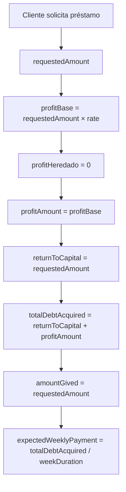

**Fórmulas:**
- `profitBase = requestedAmount × rate`
- `profitAmount = profitBase` (no hay herencia)
- `totalDebtAcquired = requestedAmount + profitAmount`
- `amountGived = requestedAmount` (préstamo nuevo)

**Ejemplo:**
- `requestedAmount`: $3,000
- `rate`: 40% (0.40)
- `profitBase`: $3,000 × 0.40 = $1,200
- `profitAmount`: $1,200
- `totalDebtAcquired`: $3,000 + $1,200 = $4,200
- `amountGived`: $3,000

### Renovación

Para una renovación (con préstamo anterior):

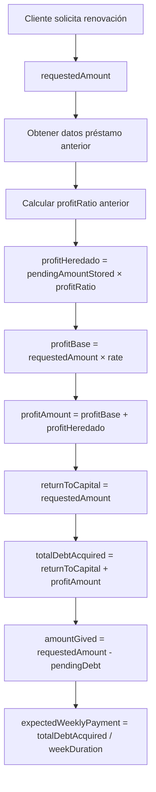

**Fórmulas:**
- `profitRatio = previousProfitAmount / previousTotalDebt`
- `profitHeredado = pendingAmountStored × profitRatio`
- `profitBase = requestedAmount × rate`
- `profitAmount = profitBase + profitHeredado`
- `totalDebtAcquired = requestedAmount + profitAmount`
- `amountGived = max(0, requestedAmount - pendingDebt)`

**⚠️ IMPORTANTE:** Solo se hereda la **porción de profit** de la deuda pendiente, NO la deuda pendiente completa.

---

## Distribución de Pagos

Cada pago se distribuye proporcionalmente entre profit y return to capital según el profit ratio del préstamo.

### Fórmula Normal

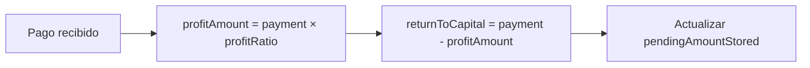

**Fórmulas:**
- `profitPorPago = (paymentAmount × totalProfit) / totalDebtAcquired`
- `returnToCapitalPorPago = paymentAmount - profitPorPago`

**Ejemplo:**
- Pago: $300
- `totalProfit`: $1,200
- `totalDebtAcquired`: $4,200
- `profitRatio`: 1200/4200 = 0.2857 (28.57%)
- `profitPorPago`: $300 × 0.2857 = $85.71
- `returnToCapitalPorPago`: $300 - $85.71 = $214.29

### Bad Debt (Mala Deuda)

Cuando un préstamo está marcado como bad debt (tiene `badDebtDate`), **100% del pago va a profit**:

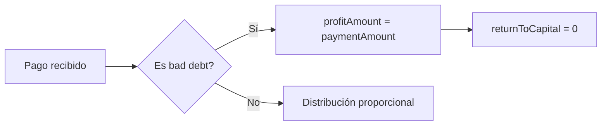

**Fórmula:**
- `profitAmount = paymentAmount` (100%)
- `returnToCapital = 0`

Esto incentiva la cobranza después de declarar mala deuda.

### Edge Cases de Pagos

1. **División por cero**: Si `totalDebtAcquired = 0`, todo el pago va a `returnToCapital`
2. **Profit mayor al pago**: El profit NUNCA puede exceder el monto del pago (protección contra datos corruptos)
3. **Pago mayor a deuda pendiente**: El `pendingAmountStored` nunca puede ser negativo

---

## Renovaciones

### Proceso de Renovación

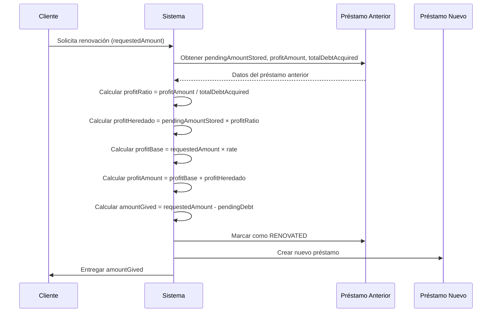

### Reglas de Negocio

1. **La deuda pendiente se descuenta del monto entregado**, NO se suma a la deuda total
2. El nuevo préstamo calcula sus métricas únicamente sobre el `requestedAmount`
3. El préstamo anterior se marca como `RENOVATED`
4. Solo se hereda la **porción de profit** de la deuda pendiente

---

## Ejemplo Completo: Crédito a 14 Semanas

### Crédito Original (Semana 1)

| Campo | Valor | Fórmula |
|-------|-------|---------|
| Cantidad Solicitada | $3,000 | - |
| Cantidad Otorgada | $3,000 | = Cantidad Solicitada (nuevo crédito) |
| Profit Base | $1,200 | = $3,000 × 40% |
| Profit Heredado | $0 | (no hay crédito anterior) |
| Profit Total | $1,200 | = Profit Base + Profit Heredado |
| Return To Capital | $3,000 | = Cantidad Solicitada |
| Deuda Total | $4,200 | = Profit Total + Return To Capital |
| Duración | 14 semanas | - |
| Pago Semanal | $300 | = $4,200 / 14 semanas |

### Distribución por Pago

Cada pago de $300 se divide proporcionalmente:

- **Profit por pago**: $300 × ($1,200 / $4,200) = $85.71
- **Return To Capital por pago**: $300 - $85.71 = $214.29

### Estado en Semana 10 (Diferentes Escenarios)

| Escenario | Pagos Realizados | Total Pagado | Profit Cobrado | Return Cobrado | Profit Pendiente | Return Pendiente | Deuda Pendiente |
|-----------|------------------|--------------|----------------|---------------|------------------|------------------|-----------------|
| **A: 0 pagos** | 0 | $0 | $0 | $0 | $1,200.00 | $3,000.00 | $4,200.00 |
| **B: 5 pagos** | 5 | $1,500 | $428.57 | $1,071.43 | $771.43 | $1,928.57 | $2,700.00 |
| **C: 8 pagos** | 8 | $2,400 | $685.71 | $1,714.29 | $514.29 | $1,285.71 | $1,800.00 |
| **D: 10 pagos** | 10 | $3,000 | $857.14 | $2,142.86 | $342.86 | $857.14 | $1,200.00 |

### Renovación en Semana 10

#### Escenario A: Renueva sin haber pagado nada (0 pagos de 14)

**Crédito anterior:** Deuda pendiente = $4,200, Profit pendiente = $1,200

| Campo | Valor | Fórmula |
|-------|-------|---------|
| Deuda Pendiente Anterior | $4,200.00 | = $4,200 - (0 × $300) |
| Cantidad Solicitada | $3,000 | - |
| Cantidad Otorgada | **-$1,200.00** | = $3,000 - $4,200 |
| Profit Base | $1,200 | = $3,000 × 40% |
| Profit Heredado | $1,200.00 | = $1,200 - (0 × $85.71) |
| Profit Total | $2,400.00 | = $1,200 + $1,200 |
| Return To Capital | $3,000 | = Cantidad Solicitada |
| Deuda Total Nueva | $5,400.00 | = $2,400 + $3,000 |

**Nota:** En este caso, `amountGived = 0` (no se entrega dinero, solo se renueva la deuda).

#### Escenario B: Renueva habiendo pagado 5 semanas (5 de 14)

**Crédito anterior:** Deuda pendiente = $2,700, Profit pendiente = $771.43

| Campo | Valor | Fórmula |
|-------|-------|---------|
| Deuda Pendiente Anterior | $2,700.00 | = $4,200 - (5 × $300) |
| Cantidad Solicitada | $3,000 | - |
| Cantidad Otorgada | $300 | = $3,000 - $2,700 |
| Profit Base | $1,200 | = $3,000 × 40% |
| Profit Heredado | $771.43 | = $1,200 - (5 × $85.71) |
| Profit Total | $1,971.43 | = $1,200 + $771.43 |
| Return To Capital | $3,000 | = Cantidad Solicitada |
| Deuda Total Nueva | $4,971.43 | = $1,971.43 + $3,000 |

#### Escenario C: Renueva habiendo pagado 8 semanas (8 de 14)

**Crédito anterior:** Deuda pendiente = $1,800, Profit pendiente = $514.29

| Campo | Valor | Fórmula |
|-------|-------|---------|
| Deuda Pendiente Anterior | $1,800.00 | = $4,200 - (8 × $300) |
| Cantidad Solicitada | $3,000 | - |
| Cantidad Otorgada | $1,200 | = $3,000 - $1,800 |
| Profit Base | $1,200 | = $3,000 × 40% |
| Profit Heredado | $514.29 | = $1,200 - (8 × $85.71) |
| Profit Total | $1,714.29 | = $1,200 + $514.29 |
| Return To Capital | $3,000 | = Cantidad Solicitada |
| Deuda Total Nueva | $4,714.29 | = $1,714.29 + $3,000 |

#### Escenario D: Renueva habiendo pagado 10 semanas (10 de 14) - LO ESPERADO

**Crédito anterior:** Deuda pendiente = $1,200, Profit pendiente = $342.86

| Campo | Valor | Fórmula |
|-------|-------|---------|
| Deuda Pendiente Anterior | $1,200.00 | = $4,200 - (10 × $300) |
| Cantidad Solicitada | $3,000 | - |
| Cantidad Otorgada | $1,800 | = $3,000 - $1,200 |
| Profit Base | $1,200 | = $3,000 × 40% |
| Profit Heredado | $342.86 | = $1,200 - (10 × $85.71) |
| Profit Total | $1,542.86 | = $1,200 + $342.86 |
| Return To Capital | $3,000 | = Cantidad Solicitada |
| Deuda Total Nueva | $4,542.86 | = $1,542.86 + $3,000 |

### Resumen Comparativo de Renovaciones (Semana 10)

| Escenario | Pagos | Deuda Pendiente | Profit Heredado | Cantidad Otorgada | Profit Total | Deuda Total Nueva |
|-----------|-------|-----------------|-----------------|-------------------|--------------|-------------------|
| **A: 0 pagos** | 0 | $4,200.00 | $1,200.00 | **-$1,200.00** | $2,400.00 | $5,400.00 |
| **B: 5 pagos** | 5 | $2,700.00 | $771.43 | $300.00 | $1,971.43 | $4,971.43 |
| **C: 8 pagos** | 8 | $1,800.00 | $514.29 | $1,200.00 | $1,714.29 | $4,714.29 |
| **D: 10 pagos** | 10 | $1,200.00 | $342.86 | $1,800.00 | $1,542.86 | $4,542.86 |

**Nota:** En un crédito a 14 semanas renovando en semana 10, aún faltan 4 pagos.

- Deuda pendiente: 4 × $300 = $1,200
- Profit pendiente: 4 × $85.71 = $342.86 (Escenario D)

### Fórmulas Clave

```
Deuda Pendiente = Deuda Total Original - (Pagos × Pago Semanal)

Profit Heredado = Profit Original - (Pagos × Profit por Pago)
                 = PendingAmountStored × (ProfitAmount / TotalDebtAcquired)

Cantidad Otorgada = Cantidad Solicitada - Deuda Pendiente

Profit Total = Profit Base + Profit Heredado

Deuda Total Nueva = Profit Total + Return To Capital
```

---

## Edge Cases

### 1. Renovación con Deuda Pendiente Mayor al Monto Solicitado

**Escenario:** Cliente solicita $3,000 pero tiene $4,200 de deuda pendiente.

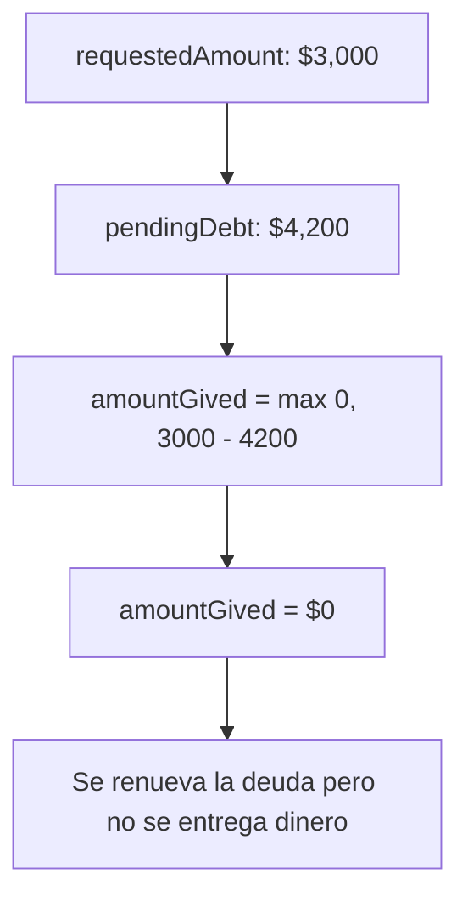

**Resultado:**
- `amountGived = 0` (no puede ser negativo)
- El profit heredado se calcula normalmente
- La deuda total nueva incluye el profit heredado

### 2. Renovación con Diferente Tasa

**Escenario:** Préstamo anterior al 40%, renovación al 30%.

**Cálculo:**
- `profitBase` se calcula con la nueva tasa (30%)
- `profitHeredado` se calcula con el ratio del préstamo anterior (40%)
- `profitTotal = profitBase + profitHeredado`

### 3. Renovación con Diferente Monto Solicitado

**Escenario:** Préstamo anterior de $3,000, renovación solicitando $5,000.

**Cálculo:**
- `profitBase = $5,000 × rate` (nuevo monto)
- `profitHeredado` se calcula del préstamo anterior (independiente del nuevo monto)
- `amountGived = $5,000 - pendingDebt`

### 4. Pago Mayor a Deuda Pendiente

**Escenario:** Deuda pendiente: $100, Pago recibido: $300.

**Resultado:**
- `newPendingAmount = 0` (no puede ser negativo)
- El préstamo se marca como `FINISHED`
- El exceso no se registra (o se maneja según política de negocio)

### 5. División por Cero en Profit Ratio

**Escenario:** `totalDebtAcquired = 0` (préstamo corrupto o cancelado).

**Protección:**
- Si `totalDebtAcquired = 0`, todo el pago va a `returnToCapital`
- `profitAmount = 0`

### 6. Profit Mayor al Pago (Datos Corruptos)

**Escenario:** Por error, `loanProfit > loanTotalDebt`.

**Protección:**
- El profit calculado NUNCA puede exceder el monto del pago
- Si `profitAmount > paymentAmount`, entonces `profitAmount = paymentAmount`

### 7. Bad Debt Payment

**Escenario:** Préstamo marcado como bad debt, se recibe un pago.

**Resultado:**
- `profitAmount = paymentAmount` (100%)
- `returnToCapital = 0`
- Esto incentiva la cobranza después de declarar mala deuda

### 8. Renovación Múltiple

**Escenario:** Cliente renueva varias veces seguidas.

**Cálculo:**
- Cada renovación calcula el `profitHeredado` del préstamo inmediatamente anterior
- El `profitHeredado` acumula el profit de todos los préstamos anteriores indirectamente

### 9. Préstamo Completamente Pagado Antes de Renovar

**Escenario:** Cliente paga todo el préstamo y luego solicita renovación.

**Resultado:**
- `pendingAmountStored = 0`
- `profitHeredado = 0`
- Se trata como préstamo nuevo

### 10. Renovación con Diferente Duración

**Escenario:** Préstamo anterior de 14 semanas, renovación a 10 semanas.

**Cálculo:**
- `profitBase` y `profitHeredado` no cambian
- Solo cambia `expectedWeeklyPayment = totalDebtAcquired / 10`

---

## Diagramas de Flujo

### Flujo Completo: Creación de Préstamo

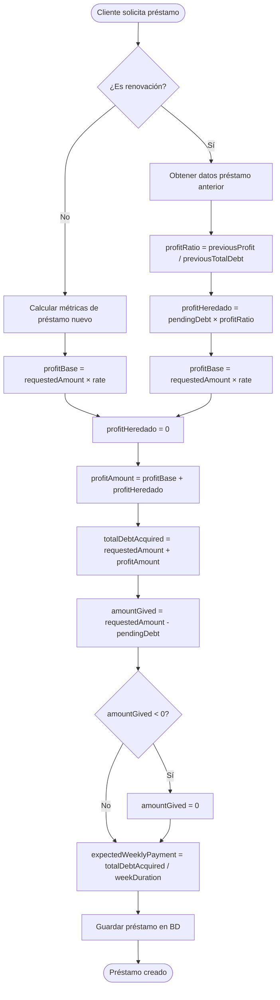

### Flujo Completo: Procesamiento de Pago

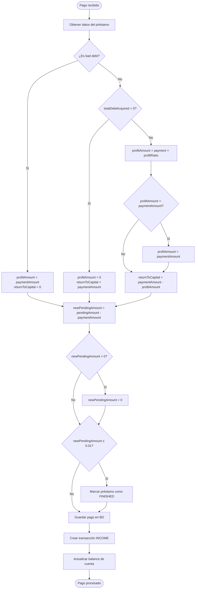

### Flujo de Renovación con Cálculo de Profit Heredado

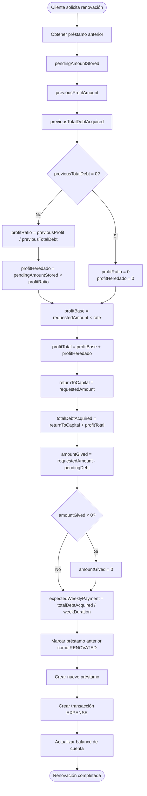

### Diagrama de Estados del Préstamo

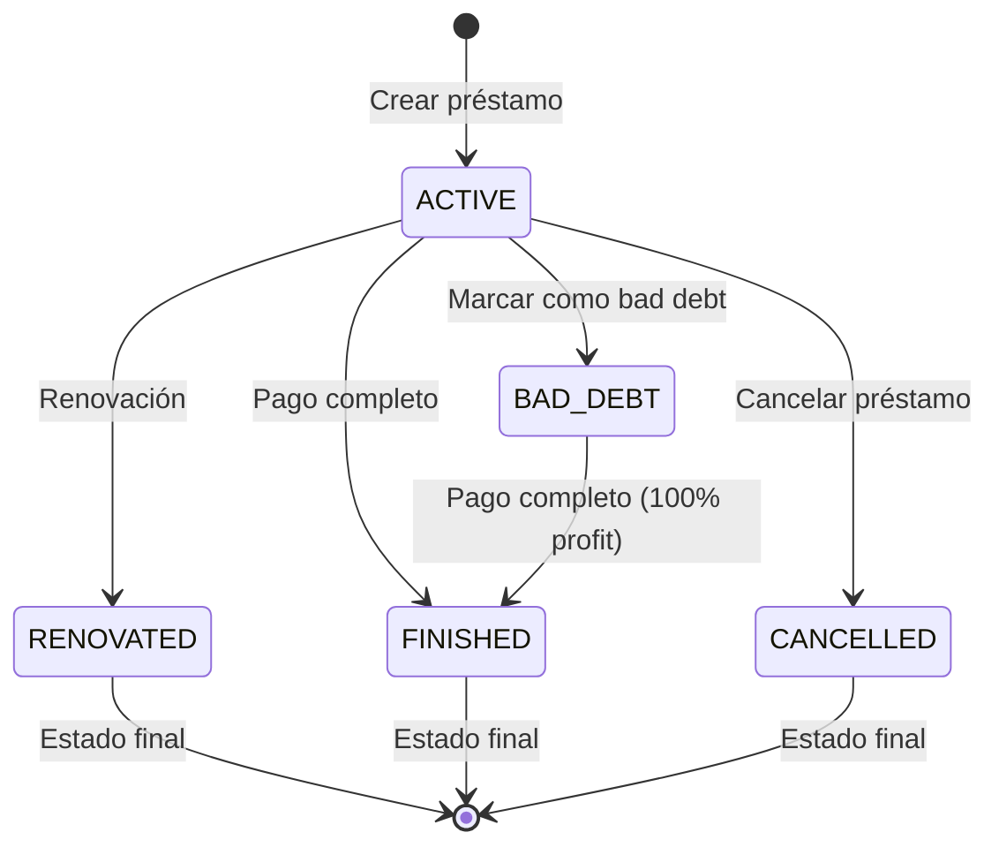

---

## Validaciones y Protecciones

### Validaciones Implementadas

1. **Profit nunca excede el pago**: `if (profitAmount > paymentAmount) profitAmount = paymentAmount`
2. **Pending amount nunca es negativo**: `if (newPendingAmount < 0) newPendingAmount = 0`
3. **Amount gived nunca es negativo**: `if (amountGived < 0) amountGived = 0`
4. **División por cero protegida**: Verificación antes de dividir
5. **Bad debt payment**: 100% a profit cuando `badDebtDate` existe

### Precisión Decimal

Todos los cálculos usan `Decimal.js` para evitar errores de precisión de punto flotante:
- Redondeo a 2 decimales para montos monetarios
- Redondeo a 4 decimales para ratios

---

## Casos de Uso: Edición y Cancelación de Créditos

### Use Case 1: Editar Monto Solicitado/Entregado

**Escenario:** Se crea un crédito y luego se edita el valor solicitado o entregado.

**Proceso:**

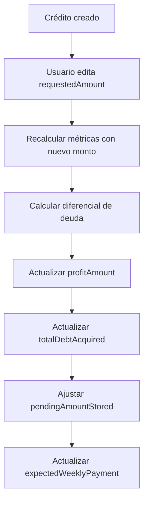

**Fórmulas:**

```typescript
// 1. Recalcular métricas con nuevo monto
const newRequestedAmount = new Decimal(input.requestedAmount)
const rate = new Decimal(currentLoantype.rate)
const metrics = calculateLoanMetrics(newRequestedAmount, rate, weekDuration)

// 2. Calcular diferencial de deuda
const oldTotalDebt = new Decimal(loan.totalDebtAcquired)
const newTotalDebt = metrics.totalDebtAcquired
const debtDiff = newTotalDebt.minus(oldTotalDebt)

// 3. Ajustar deuda pendiente
const currentPending = new Decimal(loan.pendingAmountStored)
const newPending = currentPending.plus(debtDiff)
```

**Campos Actualizados:**

| Campo | Fórmula | Descripción |
|-------|---------|-------------|
| `requestedAmount` | Nuevo valor | Monto solicitado actualizado |
| `profitAmount` | `newRequestedAmount × rate` | Profit recalculado |
| `totalDebtAcquired` | `requestedAmount + profitAmount` | Deuda total recalculada |
| `pendingAmountStored` | `currentPending + debtDiff` | Deuda pendiente ajustada |
| `expectedWeeklyPayment` | `totalDebtAcquired / weekDuration` | Pago semanal recalculado |

**Ejemplo:**

**Estado Inicial:**
- `requestedAmount`: $3,000
- `rate`: 40%
- `profitAmount`: $1,200
- `totalDebtAcquired`: $4,200
- `pendingAmountStored`: $4,200

**Edición:** Cambiar `requestedAmount` a $4,000

**Cálculo:**
- `newProfitAmount`: $4,000 × 0.40 = $1,600
- `newTotalDebtAcquired`: $4,000 + $1,600 = $5,600
- `debtDiff`: $5,600 - $4,200 = $1,400
- `newPendingAmountStored`: $4,200 + $1,400 = $5,600

**Resultado:**
- `requestedAmount`: $4,000 ✅
- `profitAmount`: $1,600 ✅
- `totalDebtAcquired`: $5,600 ✅
- `pendingAmountStored`: $5,600 ✅

**⚠️ IMPORTANTE:** Los pagos existentes NO se recalculan. Sus valores de `profitAmount` y `returnToCapital` se mantienen con el ratio original del crédito.

---

### Use Case 2: Editar Tipo de Crédito Después de Pagos

**Escenario:** Se crea un crédito, se registran 2 pagos, y luego se cambia el tipo de crédito a uno con mayor rate.

**Proceso:**

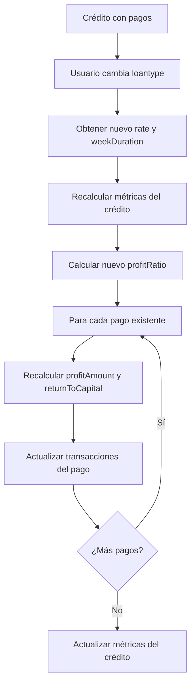

**Fórmulas:**

```typescript
// 1. Recalcular métricas del crédito con nuevo tipo
const newLoantype = await getLoantype(newLoantypeId)
const rate = new Decimal(newLoantype.rate)
const metrics = calculateLoanMetrics(requestedAmount, rate, newLoantype.weekDuration)

// 2. Calcular nuevo profit ratio
const newProfitRatio = metrics.profitAmount.dividedBy(metrics.totalDebtAcquired)

// 3. Para cada pago existente, recalcular distribución
for (const payment of existingPayments) {
  const { profitAmount, returnToCapital } = calculatePaymentProfit(
    payment.amount,
    metrics.profitAmount,
    metrics.totalDebtAcquired,
    loan.badDebtDate
  )
  
  // Actualizar transacciones del pago
  await updateTransaction({
    where: { loanPayment: payment.id, type: 'INCOME' },
    data: {
      profitAmount,
      returnToCapital,
    }
  })
}
```

**Campos Actualizados:**

**En el Crédito:**
- `loantype`: Nuevo tipo de crédito
- `profitAmount`: Recalculado con nuevo rate
- `totalDebtAcquired`: Recalculado
- `expectedWeeklyPayment`: Recalculado
- `pendingAmountStored`: Ajustado según diferencial

**En cada Pago:**
- Las transacciones `INCOME` asociadas se actualizan con:
  - `profitAmount`: Recalculado con nuevo ratio
  - `returnToCapital`: Recalculado con nuevo ratio

**Ejemplo:**

**Estado Inicial:**
- `requestedAmount`: $3,000
- `rate`: 30% (tipo A)
- `profitAmount`: $900
- `totalDebtAcquired`: $3,900
- `profitRatio`: 900/3900 = 0.2308 (23.08%)

**Pago 1:** $300
- `profitAmount`: $300 × 0.2308 = $69.23
- `returnToCapital`: $300 - $69.23 = $230.77

**Pago 2:** $300
- `profitAmount`: $300 × 0.2308 = $69.23
- `returnToCapital`: $300 - $69.23 = $230.77

**Edición:** Cambiar a tipo B con `rate: 40%`

**Cálculo Nuevo:**
- `newProfitAmount`: $3,000 × 0.40 = $1,200
- `newTotalDebtAcquired`: $3,000 + $1,200 = $4,200
- `newProfitRatio`: 1200/4200 = 0.2857 (28.57%)

**Recálculo de Pagos:**

**Pago 1 (recalculado):**
- `profitAmount`: $300 × 0.2857 = $85.71 ✅
- `returnToCapital`: $300 - $85.71 = $214.29 ✅

**Pago 2 (recalculado):**
- `profitAmount`: $300 × 0.2857 = $85.71 ✅
- `returnToCapital`: $300 - $85.71 = $214.29 ✅

**Ajuste de Deuda Pendiente:**
- `oldTotalDebt`: $3,900
- `newTotalDebt`: $4,200
- `debtDiff`: $4,200 - $3,900 = $300
- `oldPending`: $3,300 (después de 2 pagos de $300)
- `newPending`: $3,300 + $300 = $3,600 ✅

**Resultado:**
- Crédito actualizado con nuevo rate ✅
- Pagos recalculados con nuevo ratio ✅
- Transacciones actualizadas ✅
- Deuda pendiente ajustada ✅

**⚠️ IMPORTANTE:** 
- Los pagos se recalculan usando el nuevo `profitRatio` del crédito
- Las transacciones `INCOME` asociadas a cada pago se actualizan
- El `totalPaid` del crédito NO cambia (solo cambia la distribución profit/returnToCapital)

---

### Use Case 3: Cancelar/Eliminar Crédito

**Escenario:** Se cancela la creación de un crédito (se elimina el crédito).

**Proceso:**

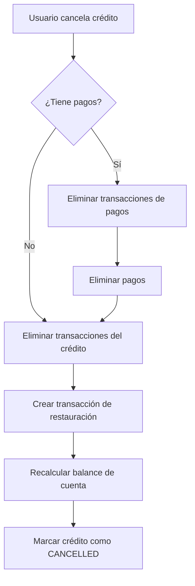

**Pasos Detallados:**

1. **Eliminar Pagos y sus Transacciones:**
   ```typescript
   const payments = await getPayments(loanId)
   for (const payment of payments) {
     // Eliminar transacciones del pago
     await deleteTransactions({ loanPayment: payment.id })
     // Eliminar el pago
     await deletePayment(payment.id)
   }
   ```

2. **Eliminar Transacciones del Crédito:**
   ```typescript
   // Eliminar transacción EXPENSE de LOAN_GRANTED
   await deleteTransactions({ loan: loanId })
   ```

3. **Crear Transacción de Restauración:**
   ```typescript
   await createTransaction({
     amount: loan.amountGived,
     type: 'INCOME',
     incomeSource: 'LOAN_CANCELLED_RESTORE',
     sourceAccount: accountId,
     // NO se asocia al loan (ya está cancelado)
   })
   ```

4. **Recalcular Balance:**
   ```typescript
   await recalculateAccountBalance(accountId)
   ```

5. **Marcar Crédito como Cancelado:**
   ```typescript
   await updateLoan(loanId, { status: 'CANCELLED' })
   ```

**Ejemplo:**

**Estado Inicial:**
- Crédito: $3,000, `amountGived`: $3,000
- Pago 1: $300
- Pago 2: $300
- `totalPaid`: $600
- `pendingAmountStored`: $3,600

**Cancelación:**

1. **Eliminar Pagos:**
   - Eliminar transacciones `INCOME` de Pago 1
   - Eliminar transacciones `INCOME` de Pago 2
   - Eliminar Pago 1
   - Eliminar Pago 2

2. **Eliminar Transacciones del Crédito:**
   - Eliminar transacción `EXPENSE` de `LOAN_GRANTED` ($3,000)

3. **Crear Transacción de Restauración:**
   - `INCOME` de `LOAN_CANCELLED_RESTORE`: $3,000
   - Restaura el `amountGived` a la cuenta

4. **Resultado:**
   - Crédito: `status = 'CANCELLED'` ✅
   - Pagos eliminados ✅
   - Transacciones eliminadas ✅
   - Balance de cuenta restaurado ✅

**⚠️ IMPORTANTE:**
- La transacción de restauración NO se asocia al loan (para evitar que se elimine)
- El `amountGived` se restaura a la cuenta, no el `totalPaid`
- Los pagos recibidos NO se restituyen (se consideran perdidos o manejados por separado)

---

## Referencias

- [API Loan Service Documentation](./api-loan-service.md)
- [Profit Calculations Source Code](../packages/business-logic/src/calculations/profit.ts)
- [Loan Engine Source Code](../packages/business-logic/src/loan-engine/LoanEngine.ts)
- [Renewal Tests](../packages/business-logic/tests/calculations/renewal.test.ts)

---

## Notas Finales

1. **Profit Heredado vs Deuda Pendiente**: Es crítico entender que solo se hereda la porción de profit, no la deuda completa. Esto es un bug común si se implementa incorrectamente.

2. **Bad Debt**: Los pagos después de marcar como bad debt van 100% a profit para incentivar la cobranza.

3. **Amount Gived**: En renovaciones, este es el monto físicamente entregado al cliente después de descontar la deuda pendiente.

4. **Profit Ratio**: Este ratio se mantiene constante durante la vida del préstamo y se usa para distribuir cada pago proporcionalmente.
