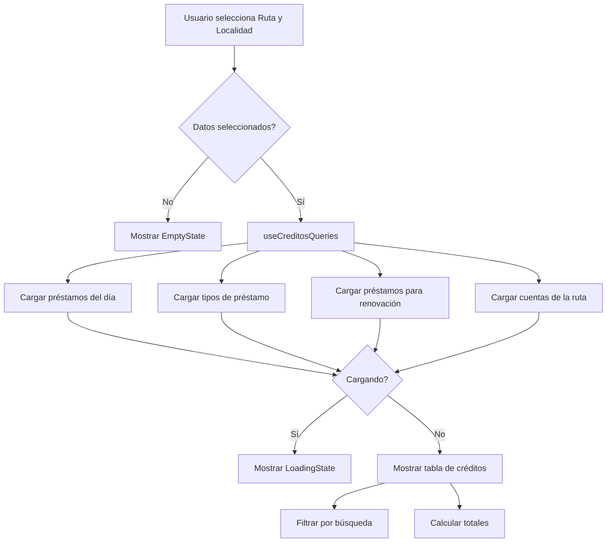
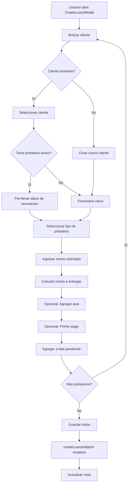
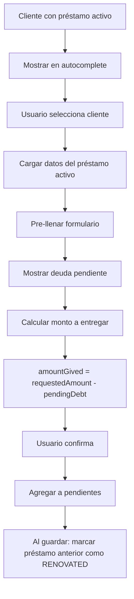
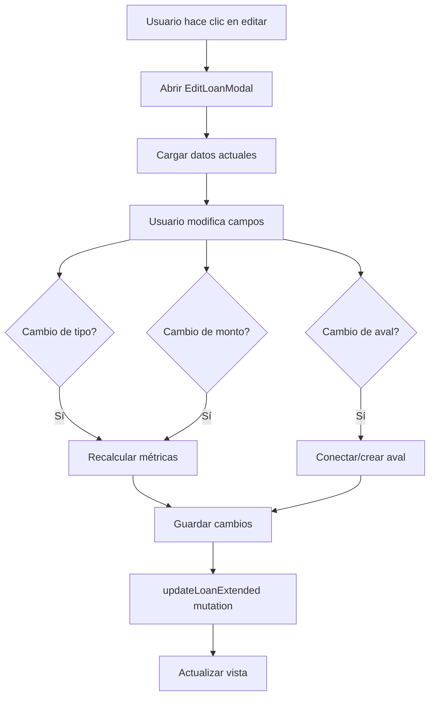
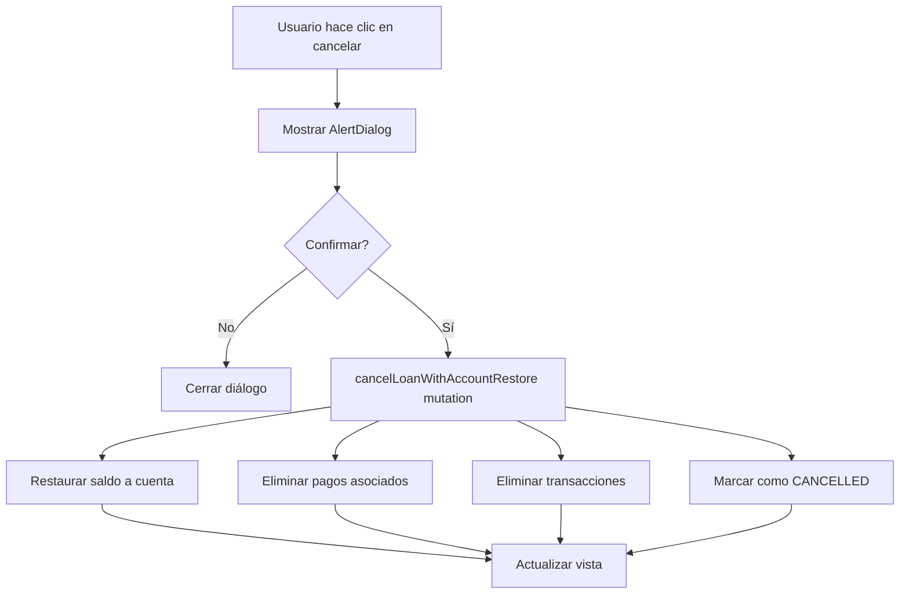
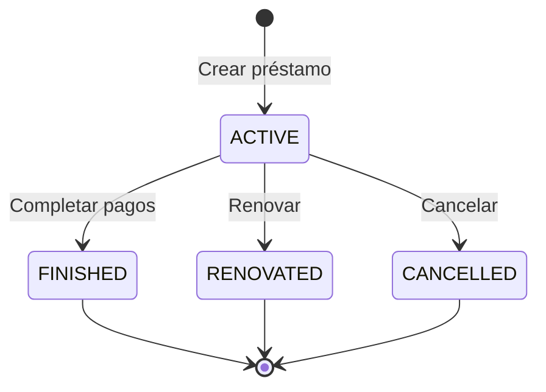

# Tab de Créditos - Documentación Técnica

## Descripción General

El tab de créditos permite a los usuarios registrar, editar y cancelar préstamos otorgados en una fecha y localidad específica. Soporta tanto préstamos nuevos como renovaciones de préstamos existentes.

## Arquitectura de Componentes

```
creditos/
├── index.tsx                 # Componente principal CreditosTab (orquestador)
├── types.ts                  # Interfaces TypeScript
├── hooks/
│   ├── index.ts              # Re-exports
│   ├── useCreditosQueries.ts # Queries de Apollo GraphQL
│   └── usePendingLoans.ts    # Estado de préstamos pendientes
└── components/
    ├── index.ts              # Re-exports
    ├── SummaryCards.tsx      # Tarjetas resumen (créditos, totales, ganancia, comisión)
    ├── AccountBalanceCard.tsx # Card con saldo de cuenta
    ├── LoansTable.tsx        # Tabla de préstamos con búsqueda
    ├── LoanTableRow.tsx      # Fila individual de préstamo
    ├── CancelLoanDialog.tsx  # Diálogo de confirmación de cancelación
    ├── EditLoanModal.tsx     # Modal para editar préstamos
    ├── LocationWarning.tsx   # Alerta de localidad diferente
    ├── CreateLoansModal/     # Modal para crear préstamos (carpeta)
    │   ├── index.tsx         # Componente principal orquestador
    │   ├── types.ts          # Tipos del modal
    │   ├── AccountBalanceInfo.tsx      # Info de saldo de cuenta
    │   ├── FirstPaymentControl.tsx     # Control de primer pago
    │   ├── GlobalCommissionControl.tsx # Control de comisión global
    │   ├── LoanCalculationSummary.tsx  # Resumen de cálculos
    │   ├── LoanTypeAmountFields.tsx    # Campos de tipo y monto
    │   ├── PendingLoanCard.tsx         # Card de préstamo pendiente
    │   └── RenewalSummaryInline.tsx    # Resumen de renovación
    └── UnifiedClientAutocomplete/      # Autocomplete de clientes (carpeta)
        ├── index.tsx         # Componente principal orquestador
        ├── types.ts          # Props e interfaces
        ├── ClientLoanBadges.tsx       # Badges de estado de préstamo
        ├── ClientSearchItem.tsx       # Item de búsqueda
        ├── EditClientForm.tsx         # Formulario de edición
        ├── NewClientForm.tsx          # Formulario de nuevo cliente
        ├── SelectedClientDisplay.tsx  # Visualización de cliente seleccionado
        └── hooks/
            └── useClientMutations.ts  # Mutations para clientes
```

## Flujos de Trabajo

### 1. Flujo Principal - Visualización de Créditos



### 2. Flujo de Creación de Créditos en Lote



### 3. Flujo de Renovación de Préstamo



### 4. Flujo de Edición de Préstamo



### 5. Flujo de Cancelación de Préstamo



## Cálculos Financieros

### Métricas del Préstamo

```typescript
// Fórmula para calcular métricas
profitAmount = requestedAmount × rate
totalDebtAcquired = requestedAmount + profitAmount
expectedWeeklyPayment = totalDebtAcquired / weekDuration
```

### Renovación

```typescript
// En renovaciones, la deuda pendiente se descuenta del monto entregado
amountGived = requestedAmount - previousLoan.pendingAmountStored

// totalDebtAcquired NO incluye la deuda anterior
// Se calcula únicamente sobre el nuevo préstamo
totalDebtAcquired = requestedAmount + (requestedAmount × rate)
```

## API - LoanService

### createLoansInBatch

Crea múltiples préstamos en una transacción atómica.

**Pasos:**
1. Validar fondos suficientes en cuenta origen
2. Para cada préstamo:
   - Crear/conectar borrower
   - Crear/conectar aval (opcional)
   - Calcular métricas financieras
   - Si es renovación: marcar préstamo anterior como RENOVATED
   - Crear préstamo
   - Crear transacción EXPENSE
   - Si tiene primer pago: crear pago y transacción INCOME
3. Deducir total de cuenta origen

### updateLoanExtended

Actualiza un préstamo existente con recálculo de métricas.

**Campos actualizables:**
- Tipo de préstamo (recalcula métricas)
- Monto solicitado (recalcula métricas)
- Nombre/teléfono del cliente
- Aval (conectar existente o crear nuevo)
- Comisión

### cancelLoanWithAccountRestore

Cancela un préstamo y restaura el saldo a la cuenta.

**Pasos:**
1. Restaurar monto a la cuenta
2. Crear transacción de restauración
3. Eliminar pagos y sus transacciones
4. Eliminar transacciones del préstamo
5. Marcar préstamo como CANCELLED

## Estados del Préstamo



## Componente UnifiedClientAutocomplete

### Modos de Operación

| Modo | Descripción | Query utilizada |
|------|-------------|-----------------|
| `borrower` | Buscar/crear clientes | `SEARCH_BORROWERS_QUERY` |
| `aval` | Buscar/crear avales | `SEARCH_PERSONAL_DATA_QUERY` |

### Estados del Cliente

```typescript
type ClientState = 'existing' | 'new' | 'edited' | 'renewed' | 'newClient'
type ClientAction = 'connect' | 'create' | 'update' | 'clear'
```

### Funcionalidades

- Búsqueda con debounce (300ms)
- Priorización por localidad actual
- Indicador visual de clientes con deuda
- Edición inline de nombre/teléfono
- Creación de nuevos clientes
- Warning para clientes de otras localidades

## Control de Acceso

Las columnas de **Capital** y **Ganancia** en la tabla de créditos solo son visibles para usuarios con rol `ADMIN`.

```typescript
const { user } = useAuth()
const isAdmin = user?.role === 'ADMIN'

// En la tabla:
{isAdmin && (
  <>
    <TableHead>Capital</TableHead>
    <TableHead>Ganancia</TableHead>
  </>
)}
```

## Queries GraphQL

### LOANS_BY_DATE_LEAD_QUERY
Obtiene préstamos otorgados en una fecha específica para un lead.

### ACTIVE_LOANS_FOR_RENEWAL_QUERY
Obtiene préstamos activos disponibles para renovación.

### LOAN_TYPES_QUERY
Obtiene los tipos de préstamo disponibles.

### ACCOUNTS_QUERY
Obtiene las cuentas de efectivo de la ruta.

## Dependencias

- `@apollo/client` - GraphQL client
- `date-fns` - Manipulación de fechas
- `lucide-react` - Iconos
- `@/components/ui/*` - Componentes de UI (shadcn)
- `@/hooks/use-auth` - Autenticación
- `@/hooks/use-toast` - Notificaciones
